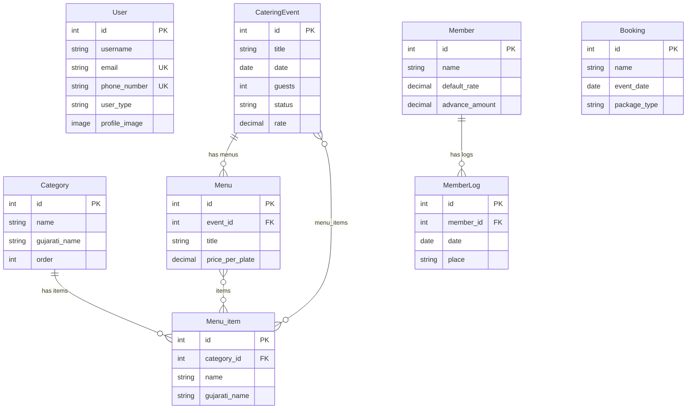
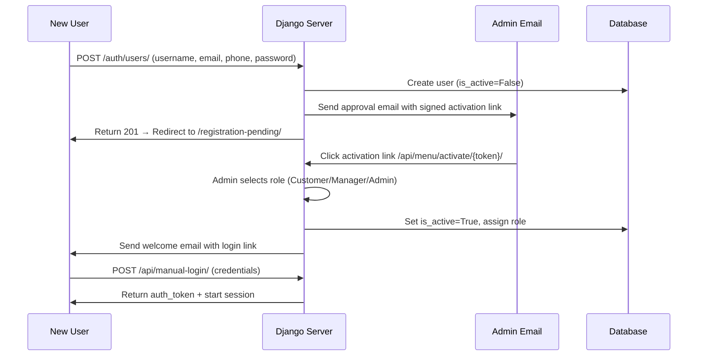

# 🍽️ Swagat Caterers – Enterprise Catering Management System

<div align="center">

<<<<<<< HEAD


=======


>>>>>>> 0594ee3638aff1ceb6ee914a3d35495d63960eea


**A Complete Digital Transformation of Traditional Catering Business**

[🌐 Live Website](https://swagat-caterers-platform-production.up.railway.app) • [📧 Contact](#-contact) • [🚀 Features](#-key-features) • [💼 Author](#-author)

---

</div>

## ⚠️ Code Protection Notice

> **🔒 This is a CLOSED-SOURCE, PROPRIETARY project.**

This repository is **PUBLIC for viewing and evaluation purposes ONLY**.

### ❌ NOT Permitted:
- Copying, cloning, or forking this code
- Using any part of this code in your own projects
- Modifying or creating derivative works
- Commercial or personal use without explicit permission
- Redistributing or sharing the code

### ✅ Permitted:
- Viewing the code for learning and understanding
- Evaluating the project for employment/collaboration opportunities
- Providing feedback or suggestions to the author

### 📜 Legal Notice:
All code, designs, and intellectual property are owned exclusively by **Preet Makadiya** and **Swagat Caterers**. Unauthorized use will be pursued legally.

**For licensing or collaboration:** Contact [makadiyapreeta1@gmail.com](mailto:makadiyapreeta1@gmail.com)

---

## 📖 Table of Contents

- [Overview](#-overview)
<<<<<<< HEAD
- [Key Features](#-key-features)
- [Tech Stack](#️-tech-stack)
- [Project Structure](#-project-structure)
- [System Architecture](#️-system-architecture)
- [Database Schema](#-database-schema--models)
- [API Reference](#-api-reference)
- [Frontend Pages & Components](#-frontend-pages--components)
- [Authentication & Security](#-authentication--security)
- [Email & Notification System](#-email--notification-system)
- [Deployment & Infrastructure](#-deployment--infrastructure)
- [Environment Variables](#-environment-variables)
- [Local Development Setup](#-local-development-setup)
=======
- [Vision & Impact](#-vision--impact)
- [Key Features](#-features)
- [Tech Stack](#️-tech-stack)
- [System Architecture](#️-system-architecture)
>>>>>>> 0594ee3638aff1ceb6ee914a3d35495d63960eea
- [Use Cases](#-use-cases)
- [Project Statistics](#-project-statistics)
- [Screenshots](#-screenshots)
- [Author](#-author)
- [License](#-license)
- [Contact](#-contact)

---

## 🎯 Overview

<<<<<<< HEAD
**Swagat Caterers** is a production-grade, full-stack catering management platform built with **Django 6.0** and **Django REST Framework**. It digitizes every aspect of a catering business — from public-facing menu browsing and online booking to internal event management, staff tracking, financial analytics, and automated billing.

The platform serves two distinct audiences:
- **Public Customers** — Browse menus, get price estimates, book events, and contact the business
- **Internal Staff (Managers/Admins)** — Manage events, track members/staff, create custom menus, generate bills, and view analytics via a protected dashboard

### 🌟 What Makes It Special?

| Feature | Description |
|---------|-------------|
| **Role-Based Access** | Three-tier user system (Customer, Manager, Admin) with admin-approved registration |
| **Bilingual Menus** | Complete English & Gujarati support with PDF generation in both languages |
| **Real Business** | Not a portfolio demo — serves an actual catering operation at [swagatcaterers.in](https://swagatcaterers.in) |
| **Cloud-Native** | Deployed on Railway with PostgreSQL, Cloudinary media, and Brevo transactional email |
| **Admin Approval Flow** | New users require admin approval via email link before account activation |

---

## ✨ Key Features

### 🌐 Public-Facing (No Login Required)

| Feature | Description |
|---------|-------------|
| **Home Page** | Hero section, featured packages, testimonials, stats, FAQ, and CTAs |
| **Interactive Menu** | Categorized menu browsing with images and bilingual support (EN/GU) |
| **Custom Menu Builder** | Drag-and-drop menu customization with live price estimation |
| **Online Booking** | Multi-step booking form with email notification to business owner |
| **Gallery** | Event photography and food presentation showcase |
| **Contact** | Multiple contact methods, embedded Google Maps, and enquiry form |
| **Menu Flipbook** | Interactive page-turning menu experience with zoom and fullscreen |
| **PDF Downloads** | Downloadable English and Gujarati menu PDFs |

### 🔒 Protected Dashboard (Login Required)

| Feature | Description |
|---------|-------------|
| **Dashboard** | Central hub with event overview, quick actions, and analytics |
| **Event Management** | Full CRUD for catering events with status tracking (Pending/Confirmed/Cancelled) |
| **Menu Creator** | Create multiple menus per event with per-plate pricing |
| **Member Tracker** | Track staff members, daily logs, rates, advances, and settlements |
| **Booking Management** | View and manage customer booking enquiries |
| **Bill Generator** | Generate printable bills with cost breakdowns |
| **Profile Management** | Update profile image, email, and phone (stored on Cloudinary) |
| **Direct Menu View** | Quick menu reference for event managers |
=======
**Swagat Caterers** is a comprehensive, enterprise-grade catering management platform that revolutionizes how catering businesses operate in the digital age. This full-stack application bridges the gap between traditional catering services and modern business automation, providing a complete solution from customer-facing booking to internal staff management.

Built over **46 days** of intensive development, this platform represents a complete digital transformation journey - from a simple frontend website to a sophisticated business management system with real-time analytics, role-based access control, and automated workflows.

### 🌟 What Makes It Special?

- **Production-Ready Full-Stack Application**: Complete end-to-end implementation with frontend, backend, and database
- **Real Business Solution**: Currently powering actual catering operations with live bookings
- **Enterprise-Grade Features**: Role-based access, analytics dashboard, staff tracking, and automated workflows
- **Bilingual Platform**: Full English and Gujarati support for diverse customer base
- **Scalable Architecture**: Built to handle growing business needs with 1,343 API endpoints
- **Premium User Experience**: Elegant black and gold theme with intuitive interfaces

---

## 💡 Vision & Impact

This project goes beyond being just a website - it's a complete business transformation platform.

### For Customers
- ✨ Seamless online booking experience with real-time calendar availability
- 📱 Browse bilingual menus (English & Gujarati) with detailed descriptions
- 💰 Instant price quotations based on guest count and menu selection
- 📄 Professional bill generation and download
- 📧 Automated email confirmations and booking updates
- 🎯 Transparent pricing with no hidden costs

### For Business Owners & Admins
- 📊 **Comprehensive Analytics Dashboard**: Real-time insights into bookings, revenue, and trends
- 👥 **Staff Management System**: Track advances, settled funds, and daily wages with visual graphs
- 📅 **Real-Time Booking Calendar**: Manage events, avoid conflicts, and optimize scheduling
- 🔐 **Secure User Management**: Email-based authentication with role assignment
- 🍽️ **Direct Menu Creation**: Add, edit, and manage menu items in both languages
- 💼 **Financial Tracking**: Monitor business performance with detailed reports
- 📈 **Growth Metrics**: Data-driven insights for business expansion

### For Managers
- 📋 **Event Coordination**: Access booking details and customer requirements
- 👨‍🍳 **Menu Management**: Update and customize menus based on availability
- 📞 **Customer Communication**: Handle inquiries and follow-ups efficiently
- 📊 **Performance Monitoring**: View relevant analytics (with appropriate restrictions)

### For Staff Members
- 💵 **Wage Tracking**: View daily wages and payment history
- 📝 **Advance Management**: Track advances taken and settlements
- 📊 **Personal Dashboard**: Individual performance metrics and graphs

### Technical Excellence
- 🏗️ **Full-Stack Mastery**: Demonstrates complete system design from database to UI
- 🔧 **RESTful API Design**: 1,343 well-structured endpoints across Django and Express.js
- 🗄️ **Database Architecture**: Robust PostgreSQL schema handling complex relationships
- 🎨 **Frontend Craftsmanship**: Responsive, accessible, and performant interfaces
- 🔒 **Security Best Practices**: Authentication, authorization, and data protection
- 📦 **Deployment & DevOps**: Production deployment on Railway with CI/CD

---

## ✨ Features

### 🎨 Customer-Facing Features

#### 1. **Interactive Menu System**
- **Bilingual Menu Display**: Complete menus in English and Gujarati
- **Category-Based Organization**: Starters, Main Course, Desserts, Beverages, etc.
- **Visual Dish Presentation**: High-quality images with detailed descriptions
- **Search & Filter**: Quick access to specific dishes or dietary preferences
- **Custom Menu Builder**: Select and customize dishes for your event
- **Live Price Calculator**: Real-time pricing based on selections and guest count

#### 2. **Real-Time Booking System**
- **Interactive Calendar**: View available dates and time slots
- **Instant Booking Confirmation**: Real-time availability check
- **Multi-Step Booking Form**: Easy-to-navigate event details collection
- **Guest Count Management**: Flexible headcount with automatic pricing
- **Event Type Selection**: Weddings, Corporate, Religious, Private events
- **Special Requests**: Custom requirements and dietary restrictions

#### 3. **Professional Documentation**
- **Digital Bill Generation**: Professional, printable bills with GST details
- **Booking Confirmation**: Automated email confirmations
- **Menu PDFs**: Downloadable menu cards in both languages
- **Quote Summaries**: Detailed pricing breakdowns

#### 4. **Customer Communication**
- **Multi-Channel Contact**: Form, Email, WhatsApp, Phone
- **Automated Email Notifications**: Booking confirmations and updates
- **Status Tracking**: Real-time booking status updates
- **Direct Messaging**: Quick communication with catering team

---

### 🔐 Admin Panel Features

#### 5. **Comprehensive Dashboard**
- **Real-Time Analytics**: 
  - Total bookings and revenue
  - Monthly/weekly/daily trends
  - Popular menu items and packages
  - Customer demographics
  - Booking conversion rates
- **Visual Data Representation**: 
  - Interactive charts and graphs
  - Revenue trends over time
  - Booking density heatmaps
  - Staff performance metrics
- **Quick Actions**: 
  - Create new bookings
  - Manage staff
  - Update menus
  - Generate reports

#### 6. **User Management System**
- **Role-Based Access Control**:
  - **Admin**: Full system access and control
  - **Manager**: Event and menu management (restricted financial data)
  - **Customer**: Booking and profile management
- **Email Authentication**: Secure signup with admin approval via email
- **User Profiles**: Detailed information and activity history
- **Permission Management**: Granular control over feature access

#### 7. **Staff Tracking & Financial Management**
- **Employee Database**: Complete staff information and roles
- **Daily Wages Tracker**: 
  - Record daily wages for each staff member
  - Automated calculations and totals
  - Payment history with dates
- **Advance Money Management**:
  - Track advances given to staff
  - Settlement tracking
  - Outstanding balance calculations
- **Financial Visualization**:
  - Individual staff financial graphs
  - Department-wise expense analysis
  - Monthly wage trends
  - Advance vs. settlement ratios
- **Restricted Access**: Hidden from managers, visible only to admins

#### 8. **Menu Management System**
- **Direct Menu Creation**: 
  - Add new dishes with images and descriptions
  - Bilingual entry (English and Gujarati)
  - Category assignment and organization
  - Pricing and availability management
- **Menu Editing**: 
  - Update existing dishes
  - Bulk operations for efficiency
  - Archive or remove dishes
- **Package Management**: 
  - Create and customize packages
  - Assign dishes to packages
  - Set package pricing and terms

#### 9. **Booking Management**
- **Calendar View**: 
  - Monthly/weekly/daily views
  - Color-coded event types
  - Drag-and-drop rescheduling
- **Booking Details**: 
  - Complete event information
  - Customer contact details
  - Menu selections and special requests
  - Payment status and history
- **Status Management**: 
  - Pending, Confirmed, Completed, Cancelled
  - Automated status updates
  - Custom notes and updates

#### 10. **Reporting & Analytics**
- **Financial Reports**:
  - Revenue by period (daily, monthly, yearly)
  - Package-wise earnings
  - Payment collection status
- **Operational Reports**:
  - Booking volume trends
  - Popular dishes and packages
  - Customer retention metrics
- **Staff Reports**:
  - Wage summaries
  - Advance reports
  - Performance metrics
- **Export Capabilities**: 
  - PDF reports
  - Excel exports
  - Custom date ranges

---

### 👔 Manager Features

#### 11. **Event Coordination**
- **Booking Access**: View and manage assigned events
- **Customer Communication**: Handle inquiries and updates
- **Menu Customization**: Adjust menus based on availability

#### 12. **Limited Analytics**
- **Event Statistics**: Booking trends and patterns
- **Menu Performance**: Popular dishes and customer preferences
- **Restricted Financial Data**: Revenue visible, staff wages hidden

---

### 📱 Additional Features

#### 13. **Responsive Design**
- Mobile-first approach for all user interfaces
- Touch-optimized controls and navigation
- Fast loading on all devices
- Progressive Web App (PWA) capabilities

#### 14. **Performance Optimization**
- Lazy loading for images and components
- API response caching
- Database query optimization
- CDN integration for static assets

#### 15. **Security Features**
- JWT-based authentication
- CSRF protection
- SQL injection prevention
- XSS protection
- Secure password hashing
- Role-based authorization on all endpoints
>>>>>>> 0594ee3638aff1ceb6ee914a3d35495d63960eea

---

## 🛠️ Tech Stack

<<<<<<< HEAD
### Backend
| Technology | Version | Purpose |
|-----------|---------|---------|
| **Python** | 3.14 | Core language |
| **Django** | 6.0 | Web framework |
| **Django REST Framework** | 3.16.1 | REST API layer |
| **Djoser** | 2.3.3 | Authentication endpoints (signup, login, token) |
| **SimpleJWT** | 5.5.1 | JWT token authentication |
| **PostgreSQL** | — | Primary database (via `psycopg2-binary`) |
| **Gunicorn** | 23.0.0 | WSGI production server |
| **WhiteNoise** | 6.11.0 | Static file serving in production |
| **Cloudinary** | 1.44.1 | Cloud media storage (images) |
| **Anymail (Brevo)** | 14.0 | Transactional email via Brevo/Sendinblue API |
| **Twilio** | 9.9.0 | SMS/WhatsApp notifications (planned) |
| **dj-database-url** | 3.1.0 | Database URL parsing for Railway |
| **Pillow** | 12.0.0 | Image processing |
| **django-cors-headers** | 4.9.0 | CORS handling |

### Frontend
| Technology | Purpose |
|-----------|---------|
| **HTML5** | Semantic markup with SEO and accessibility |
| **CSS3** | Custom properties, Flexbox, Grid, animations, media queries |
| **JavaScript (ES6+)** | DOM manipulation, API calls, form validation, dynamic content |
| **Bootstrap 5** | Responsive grid and pre-built components |
| **Django Templates** | Server-side rendering with template inheritance |
| **Font Awesome** | Icon library |
| **Google Fonts** | Playfair Display & Montserrat typography |

### Infrastructure & DevOps
| Service | Purpose |
|---------|---------|
| **Railway** | Production hosting (backend + PostgreSQL) |
| **Cloudinary** | Media file CDN and storage |
| **Brevo (Sendinblue)** | Transactional email delivery |
| **Git/GitHub** | Version control |

---

## 📁 Project Structure

```
Swagat_caterers/
├── .gitignore                       # Root gitignore (secrets, venv, OS files)
├── LICENSE                          # Proprietary license
├── README.md                        # This file
│
└── backend/                         # Django project root
    ├── manage.py                    # Django CLI entry point
    ├── Procfile                     # Railway deployment command
    ├── requirements.txt             # Python dependencies (42 packages)
    ├── check.py                     # Media path diagnostics script
    ├── .gitignore                   # Backend-specific gitignore
    │
    ├── backend_site/                # Django project configuration
    │   ├── __init__.py
    │   ├── settings.py              # Main settings (DB, email, auth, CORS, security)
    │   ├── urls.py                  # Root URL routing (69 lines, 25+ routes)
    │   ├── views.py                 # User activation view
    │   ├── wsgi.py                  # WSGI config for Gunicorn
    │   └── asgi.py                  # ASGI config
    │
    ├── catering/                    # Main Django app
    │   ├── __init__.py              # App config loader
    │   ├── apps.py                  # CateringConfig (loads signals)
    │   ├── models.py                # 8 database models (157 lines)
    │   ├── views.py                 # 20+ views — API + template rendering (340 lines)
    │   ├── serializers.py           # 10 DRF serializers (179 lines)
    │   ├── urls.py                  # App-level URL routing with DRF Router
    │   ├── admin.py                 # Custom admin with inlines & filters
    │   ├── signals.py               # Post-save email notifications (116 lines)
    │   ├── backends.py              # Custom auth: Email/Phone/Username login
    │   ├── tests.py                 # Test file
    │   └── migrations/              # 16 migration files tracking schema evolution
    │
    ├── templates/                   # HTML templates only (served by Django)
    │   ├── index.html               # Home page
    │   ├── menu.html                # Public menu browsing
    │   ├── about.html               # About page
    │   ├── gallery.html             # Photo gallery
    │   ├── contact.html             # Contact page
    │   ├── booknow.html             # Booking form
    │   ├── customize_menu.html      # Custom menu builder (33K)
    │   ├── login.html               # Login page
    │   ├── signup.html              # Registration page
    │   ├── registration_pending.html # Pending approval notice
    │   ├── dashboard.html           # Admin dashboard (45K — largest page)
    │   ├── tracker.html             # Member/staff tracking (44K)
    │   ├── booking.html             # Event booking management
    │   ├── create_menu.html         # Menu creation tool (43K)
    │   ├── direct_menu.html         # Direct menu view (30K)
    │   ├── manager_menu.html        # Manager menu interface
    │   ├── print_bill.html          # Bill generation & printing (24K)
    │   ├── profile.html             # User profile management
    │   ├── 404.html                 # Custom error page
    │   └── components/              # 28 reusable HTML components
    │       ├── navbar.html
    │       ├── footer.html
    │       ├── home_hero.html
    │       ├── pricing.html
    │       ├── testimonials.html
    │       ├── faq.html
    │       ├── gallery_grid.html
    │       ├── stats.html
    │       ├── contact_form.html
    │       ├── contact_grid.html
    │       ├── menu_book.html
    │       ├── services.html
    │       ├── services_overview.html
    │       ├── team.html
    │       ├── story.html
    │       ├── features.html
    │       ├── highlights.html
    │       ├── hygiene.html
    │       ├── signature.html
    │       ├── estimator.html
    │       ├── blog.html
    │       ├── map.html
    │       ├── marquee.html
    │       ├── cta_banner.html
    │       ├── menu_cta.html
    │       ├── final_cta_home.html
    │       ├── urgency_popup.html
    │       └── detailed_why.html
    │
    ├── static/                      # Static assets (CSS, JS, images, fonts)
    │   ├── css/
    │   │   └── style.css            # Main stylesheet (22K, black & gold theme)
    │   ├── js/
    │   │   ├── menu_data_en.js      # English menu data (19K)
    │   │   └── menu_data_gu.js      # Gujarati menu data (34K)
    │   ├── images/
    │   │   ├── logo/
    │   │   │   ├── logo.png         # Brand logo
    │   │   │   └── favicon.png      # Browser favicon
    │   │   ├── food/                # Food photography
    │   │   ├── img/                 # General images
    │   │   └── menu/                # Menu-related images
    │   ├── Gujarati.ttf             # Gujarati font
    │   └── Noto_Sans_Gujarati/      # Noto Sans Gujarati font family
    │
    ├── media/                       # User-uploaded files (Cloudinary in prod)
    │   ├── category_images/         # Menu category images
    │   └── profile_images/          # User profile pictures
    │
    ├── staticfiles/                 # Collected static files (auto-generated)
    └── venv/                        # Python virtual environment (not tracked)
=======
### Frontend Technologies

```
HTML5
├── Semantic markup for SEO optimization
├── Accessibility features (ARIA labels, semantic tags)
├── Structured data for search engines
└── Form validation and user input handling

CSS3
├── Custom properties (CSS variables) for theming
├── Flexbox and Grid layouts for responsive design
├── Smooth animations and transitions
├── Media queries (5 breakpoints: mobile to 4K)
└── Custom styling with black & gold theme

JavaScript (ES6+)
├── Asynchronous API calls (Fetch API)
├── DOM manipulation and event handling
├── Form validation and user interactions
├── Dynamic content rendering
├── Email automation integration
└── Local storage for user preferences

Bootstrap 5
├── Responsive grid system
├── Pre-built UI components
├── Utility classes for rapid development
└── Custom theme overrides
```

### Backend Technologies

```
Django 4.x
├── Django REST Framework
│   ├── Serializers for data validation
│   ├── ViewSets and routers
│   ├── Custom permissions and authentication
│   └── Pagination and filtering
├── Django ORM for database operations
├── Django Admin for content management
├── JWT authentication (djangorestframework-simplejwt)
├── CORS handling (django-cors-headers)
└── Email backend configuration

Express.js
├── RESTful API endpoints (561 endpoints)
├── Middleware for authentication
├── Request validation
├── Error handling
└── Integration with Django services

Python Libraries
├── psycopg2: PostgreSQL adapter
├── Pillow: Image processing
├── pandas: Data analysis for reports
├── matplotlib: Graph generation
└── python-dotenv: Environment configuration
```

### Database

```
PostgreSQL
├── Relational database design
├── Complex table relationships
│   ├── Users and Roles
│   ├── Bookings and Events
│   ├── Menus and Dishes
│   ├── Staff and Financial Records
│   └── Analytics and Logs
├── Indexing for performance
├── Transactions for data integrity
└── Database backup and restore
```

### DevOps & Deployment

```
Railway
├── PostgreSQL database hosting
├── Django application deployment
├── Environment variable management
├── Automatic deployments from Git
└── SSL/TLS certificates

Git & GitHub
├── Version control
├── Feature branch workflow
├── Code review and collaboration
└── Repository management
```

### Development Tools

```
VS Code
├── Python and JavaScript extensions
├── Django template support
├── Git integration
└── Debugging tools

Postman
├── API testing and documentation
├── Endpoint collections
└── Environment variables

Chrome DevTools
├── Frontend debugging
├── Network analysis
├── Performance profiling
└── Responsive design testing
>>>>>>> 0594ee3638aff1ceb6ee914a3d35495d63960eea
```

---

## 🏗️ System Architecture

<<<<<<< HEAD
```
┌──────────────────────────────────────────────────────────────────┐
│                        CLIENT (Browser)                          │
│  HTML/CSS/JS/Bootstrap • Django Templates • Fetch API calls      │
└────────────────────────────┬─────────────────────────────────────┘
                             │
                             │  HTTPS (Railway SSL)
                             ▼
┌──────────────────────────────────────────────────────────────────┐
│                    DJANGO 6.0 APPLICATION                        │
│                                                                  │
│  ┌─────────────────────┐  ┌──────────────────────────────────┐  │
│  │   Template Views    │  │      REST API (DRF 3.16)         │  │
│  │   (Server-Side)     │  │                                  │  │
│  │                     │  │  • Token Auth (Djoser)           │  │
│  │  • index, menu,     │  │  • Session Auth (login_required) │  │
│  │    about, gallery   │  │  • ViewSets (CRUD)               │  │
│  │  • dashboard,       │  │  • Custom API views              │  │
│  │    tracker, booking │  │  • JSON responses                │  │
│  └─────────────────────┘  └──────────────────────────────────┘  │
│                                                                  │
│  ┌─────────────────────┐  ┌──────────────────────────────────┐  │
│  │   Django Signals    │  │     Custom Auth Backend          │  │
│  │                     │  │                                  │  │
│  │  • post_save: Admin │  │  EmailPhoneUsernameBackend:      │  │
│  │    approval email   │  │  Login via username, email,      │  │
│  │  • pre_save: User   │  │  or phone number                │  │
│  │    welcome email    │  │                                  │  │
│  └─────────────────────┘  └──────────────────────────────────┘  │
│                                                                  │
│  ┌──────────────────┐  ┌────────────────┐  ┌────────────────┐   │
│  │   WhiteNoise     │  │   Gunicorn     │  │  CORS Headers  │   │
│  │  (Static Files)  │  │  (WSGI Server) │  │  (API Access)  │   │
│  └──────────────────┘  └────────────────┘  └────────────────┘   │
└─────────┬──────────────────────┬────────────────────┬───────────┘
          │                      │                    │
          ▼                      ▼                    ▼
┌──────────────────┐  ┌──────────────────┐  ┌──────────────────┐
│   PostgreSQL     │  │   Cloudinary     │  │   Brevo SMTP     │
│   (Railway)      │  │   (Media CDN)    │  │   (Email API)    │
│                  │  │                  │  │                  │
│  8 tables        │  │  Profile images  │  │  Admin alerts    │
│  16 migrations   │  │  Category images │  │  Welcome emails  │
│  Relational data │  │  Food photos     │  │  Booking notifs  │
└──────────────────┘  └──────────────────┘  └──────────────────┘
```

---
=======
### Complete Architecture Overview

```
┌─────────────────────────────────────────────────────────────┐
│                     Client Layer                            │
│  ┌──────────────┐  ┌──────────────┐  ┌──────────────┐     │
│  │   Web App    │  │  Admin Panel │  │ Manager Panel│     │
│  │ (HTML/CSS/JS)│  │ (HTML/CSS/JS)│  │ (HTML/CSS/JS)│     │
│  └──────┬───────┘  └──────┬───────┘  └──────┬───────┘     │
└─────────┼──────────────────┼──────────────────┼─────────────┘
          │                  │                  │
          │  REST API Calls (1,343 Endpoints)  │
          │                  │                  │
┌─────────▼──────────────────▼──────────────────▼─────────────┐
│                   API Gateway Layer                          │
│  ┌────────────────────────────────────────────────────┐     │
│  │              Django REST Framework                  │     │
│  │  ├── Authentication & Authorization (JWT)          │     │
│  │  ├── Request Validation & Serialization            │     │
│  │  ├── Rate Limiting & Throttling                    │     │
│  │  └── CORS Handling                                 │     │
│  └────────────────────────────────────────────────────┘     │
│  ┌────────────────────────────────────────────────────┐     │
│  │              Express.js Services                    │     │
│  │  ├── Email Service Integration                     │     │
│  │  ├── File Upload Handling                          │     │
│  │  └── Third-party API Integration                   │     │
│  └────────────────────────────────────────────────────┘     │
└──────────────────────────┬───────────────────────────────────┘
                           │
┌──────────────────────────▼───────────────────────────────────┐
│                   Business Logic Layer                       │
│  ┌─────────────────────────────────────────────────────┐    │
│  │                  Django Backend                      │    │
│  │  ├── Booking Management (782 endpoints)            │    │
│  │  │   ├── Real-time availability checking           │    │
│  │  │   ├── Calendar integration                       │    │
│  │  │   └── Status management                          │    │
│  │  ├── Menu Management                                │    │
│  │  │   ├── Bilingual content handling                 │    │
│  │  │   ├── Price calculation engine                   │    │
│  │  │   └── Package management                         │    │
│  │  ├── User Management                                │    │
│  │  │   ├── Role-based access control                  │    │
│  │  │   ├── Email authentication                       │    │
│  │  │   └── Profile management                         │    │
│  │  ├── Staff & Financial Management                   │    │
│  │  │   ├── Wage tracking                              │    │
│  │  │   ├── Advance management                         │    │
│  │  │   └── Settlement calculations                    │    │
│  │  ├── Analytics & Reporting                          │    │
│  │  │   ├── Real-time metrics                          │    │
│  │  │   ├── Graph generation                           │    │
│  │  │   └── Report exports                             │    │
│  │  └── Bill Generation                                │    │
│  │      ├── Professional invoices                      │    │
│  │      ├── GST calculations                           │    │
│  │      └── PDF generation                             │    │
│  └─────────────────────────────────────────────────────┘    │
└──────────────────────────┬───────────────────────────────────┘
                           │
┌──────────────────────────▼───────────────────────────────────┐
│                    Data Layer (PostgreSQL)                   │
│  ┌─────────────────────────────────────────────────────┐    │
│  │  Tables & Relationships:                            │    │
│  │  ├── Users (Admins, Managers, Customers)           │    │
│  │  ├── Bookings & Events                              │    │
│  │  ├── Menus & Dishes (Bilingual)                    │    │
│  │  ├── Packages & Pricing                             │    │
│  │  ├── Staff Records                                  │    │
│  │  ├── Financial Transactions                         │    │
│  │  │   ├── Daily Wages                                │    │
│  │  │   ├── Advances                                   │    │
│  │  │   └── Settlements                                │    │
│  │  ├── Analytics & Metrics                            │    │
│  │  └── Audit Logs                                     │    │
│  │                                                      │    │
│  │  Features:                                           │    │
│  │  ├── Foreign Key Relationships                      │    │
│  │  ├── Indexing for Performance                       │    │
│  │  ├── Triggers for Automation                        │    │
│  │  ├── Views for Complex Queries                      │    │
│  │  └── Backup & Recovery                              │    │
│  └─────────────────────────────────────────────────────┘    │
└──────────────────────────────────────────────────────────────┘

┌──────────────────────────────────────────────────────────────┐
│                    External Services                         │
│  ├── Email Service (SMTP/SendGrid)                          │
│  ├── File Storage (Railway/Local)                           │
│  ├── Payment Gateway (Future Integration)                   │
│  └── SMS Service (Future Integration)                       │
└──────────────────────────────────────────────────────────────┘
```

### API Architecture Details

#### Django REST API (782 Endpoints)

**Authentication Endpoints** (12)
- User registration, login, logout
- Password reset and change
- Email verification
- Token refresh

**Booking Endpoints** (156)
- CRUD operations for bookings
- Calendar availability
- Booking status updates
- Customer booking history
- Event type filtering

**Menu Endpoints** (98)
- Menu listing (English & Gujarati)
- Dish CRUD operations
- Category management
- Package management
- Price calculations

**Admin Endpoints** (234)
- Dashboard analytics
- User management
- Role assignment
- System configuration
- Report generation

**Staff Management Endpoints** (142)
- Staff CRUD operations
- Daily wage tracking
- Advance management
- Settlement tracking
- Financial reports with graphs

**Analytics Endpoints** (78)
- Revenue analytics
- Booking trends
- Popular dishes
- Customer insights
- Staff performance

**Bill Generation Endpoints** (24)
- Invoice creation
- GST calculations
- PDF generation
- Email delivery

**Miscellaneous Endpoints** (38)
- File uploads
- Notifications
- Search functionality
- Export capabilities

#### Express.js API (561 Endpoints)

**Email Service** (89)
- Booking confirmations
- Password resets
- Notifications
- Promotional emails

**File Handling** (142)
- Image uploads
- Menu PDFs
- Bill documents
- Report exports

**Integration Services** (178)
- Third-party APIs
- External notifications
- Calendar sync
- Payment processing hooks

**Utility Services** (152)
- Data validation
- Format conversion
- Cache management
- Logging and monitoring

### Database Schema Highlights

```sql
-- Core Tables (Simplified)

Users
├── id (PK)
├── email (unique)
├── password (hashed)
├── role (admin/manager/customer)
├── is_active
└── created_at

Bookings
├── id (PK)
├── user_id (FK → Users)
├── event_date
├── guest_count
├── event_type
├── status
├── total_amount
└── created_at

Menus
├── id (PK)
├── name_en
├── name_gu
├── description_en
├── description_gu
├── category
├── price
└── is_active

Dishes
├── id (PK)
├── menu_id (FK → Menus)
├── name_en
├── name_gu
├── description_en
├── description_gu
└── image_url

Staff
├── id (PK)
├── name
├── role
├── contact
└── joined_date

Staff_Wages
├── id (PK)
├── staff_id (FK → Staff)
├── date
├── amount
└── payment_status

Staff_Advances
├── id (PK)
├── staff_id (FK → Staff)
├── amount
├── date
├── is_settled
└── settlement_date

Analytics
├── id (PK)
├── metric_type
├── value
├── date
└── metadata (JSON)
```
>>>>>>> 0594ee3638aff1ceb6ee914a3d35495d63960eea

## 🗃️ Database Schema & Models

The application uses **8 Django models** across 16 migrations:

### 1. `User` (Custom — extends `AbstractUser`)
| Field | Type | Details |
|-------|------|---------|
| `email` | EmailField | Unique, required |
| `phone_number` | CharField(15) | Unique, optional |
| `profile_image` | ImageField | Stored on Cloudinary |
| `user_type` | CharField | Choices: `customer`, `manager`, `admin` |

### 2. `Category`
| Field | Type | Details |
|-------|------|---------|
| `name` | CharField(100) | Category name (English) |
| `gujarati_name` | CharField(100) | Category name (Gujarati) |
| `image` | ImageField | Category thumbnail |
| `order` | PositiveIntegerField | Display sort order |

### 3. `Menu_item`
| Field | Type | Details |
|-------|------|---------|
| `category` | ForeignKey → Category | Parent category |
| `name` | CharField(100) | Dish name (English) |
| `gujarati_name` | CharField(200) | Dish name (Gujarati) |
| `description` | TextField | Dish description |
| `image` | ImageField | Dish photo |

### 4. `CateringEvent`
| Field | Type | Details |
|-------|------|---------|
| `title` | CharField(200) | Event name |
| `venue` | CharField(200) | Event location |
| `contact_number` | CharField(15) | Contact phone |
| `date` | DateField | Event date |
| `guests` | IntegerField | Guest count |
| `event_type` | CharField(100) | Wedding, Corporate, etc. |
| `status` | CharField | `pending` / `confirmed` / `cancelled` |
| `rate` | DecimalField | Rate per plate |
| `advance_amount` | DecimalField | Advance payment received |
| `staff_count` | IntegerField | Staff assigned |
| `menu_items` | ManyToMany → Menu_item | Selected dishes |
| **Properties**: `total_cost` (guests × rate), `pending_amount` (total − advance), `is_settled` |

### 5. `Menu`
| Field | Type | Details |
|-------|------|---------|
| `event` | ForeignKey → CateringEvent | Parent event |
| `title` | CharField(100) | Menu name (e.g., "Lunch", "Dinner") |
| `price_per_plate` | DecimalField | Per-plate cost |
| `items` | ManyToMany → Menu_item | Dishes in this menu |
| `note` | TextField | Additional notes |

### 6. `Member`
| Field | Type | Details |
|-------|------|---------|
| `name` | CharField(100) | Staff member name |
| `phone` | CharField(15) | Phone number |
| `default_rate` | DecimalField | Default daily rate (₹500) |
| `advance_amount` | DecimalField | Running advance balance |

### 7. `MemberLog`
| Field | Type | Details |
|-------|------|---------|
| `member` | ForeignKey → Member | Parent member |
| `date` | DateField | Work date |
| `place` | CharField(200) | Work location |
| `staff_count` | IntegerField | Staff present |
| `rate`, `total_amount`, `advance_given`, `settled_amount` | DecimalField | Financial details |
| `entry_by` | CharField(100) | Who created this log |

### 8. `Booking`
| Field | Type | Details |
|-------|------|---------|
| `name` | CharField(100) | Customer name |
| `phone` | CharField(20) | Customer phone |
| `event_date` | DateField | Requested event date |
| `event_type` | CharField(50) | Type of event |
| `guest_count` | IntegerField | Number of guests |
| `meal_time` | CharField(50) | Meal timing preference |
| `package_type` | CharField(100) | Selected package |
| `venue` | CharField(200) | Event venue |
| `message` | TextField | Additional message |

### Entity Relationship Diagram



---

## 🔌 API Reference

### Authentication Endpoints (Djoser)
| Method | Endpoint | Description |
|--------|----------|-------------|
| `POST` | `/auth/users/` | Register new user |
| `POST` | `/auth/token/login/` | Get auth token |
| `POST` | `/auth/token/logout/` | Invalidate token |
| `GET` | `/auth/users/me/` | Get current user profile |
| `POST` | `/api/manual-login/` | Session + Token login (custom) |

### Menu & Category APIs
| Method | Endpoint | Auth | Description |
|--------|----------|------|-------------|
| `GET` | `/api/menu/menu-list/` | Public | Get full menu with categories & items |
| `GET/POST` | `/api/menu/categories/` | Token | List/Create categories |
| `GET/PUT/DELETE` | `/api/menu/categories/{id}/` | Token | Category CRUD |
| `GET/POST` | `/api/menu/menu-items/` | Token | List/Create menu items |
| `GET/PUT/DELETE` | `/api/menu/menu-items/{id}/` | Token | Menu item CRUD |
| `GET/POST` | `/api/menu/menus/` | Token | List/Create event menus |

### Event Management APIs
| Method | Endpoint | Auth | Description |
|--------|----------|------|-------------|
| `GET/POST` | `/api/menu/events/` | Token | List/Create catering events |
| `GET/PUT/DELETE` | `/api/menu/events/{id}/` | Token | Event CRUD |

### Member & Tracker APIs
| Method | Endpoint | Auth | Description |
|--------|----------|------|-------------|
| `GET/POST/PUT` | `/api/menu/members/` | Token | Member management (with log creation on update) |
| `GET` | `/api/menu/logs/` | Token | Read-only member logs (filterable by date range) |
| `GET` | `/api/menu/logs/?start_date=X&end_date=Y` | Token | Filter logs by date |

### Booking & Communication APIs
| Method | Endpoint | Auth | Description |
|--------|----------|------|-------------|
| `POST` | `/api/menu/api/book-event/` | Public | Submit booking enquiry + email notification |
| `POST` | `/api/menu/send-email/` | Public | Send contact enquiry email |

### User Management APIs
| Method | Endpoint | Auth | Description |
|--------|----------|------|-------------|
| `PATCH` | `/api/menu/update-profile/` | Token | Update email, phone, or profile image |
| `GET/POST` | `/api/menu/activate/{token}/` | Admin Link | Approve & activate new users |

---

## 🖥️ Frontend Pages & Components

### Public Pages (19 HTML templates)
| Page | File | Size | Description |
|------|------|------|-------------|
| Home | `index.html` | 6.6K | Landing page with hero, packages, testimonials |
| Menu | `menu.html` | 10K | Public menu browsing with categories |
| Custom Menu | `customize_menu.html` | 33K | Interactive menu builder with price estimation |
| Book Now | `booknow.html` | 6.8K | Multi-step booking form |
| About | `about.html` | 3.3K | Company story, team, and values |
| Gallery | `gallery.html` | 3.8K | Event photo showcase |
| Contact | `contact.html` | 3.3K | Contact form with Google Maps |
| Login | `login.html` | 7.7K | Login page (username/email/phone) |
| Signup | `signup.html` | 7.5K | Registration form |
| Pending | `registration_pending.html` | 2.4K | Approval waiting screen |
| 404 | `404.html` | 11.6K | Custom error page |

### Protected Pages (Login Required)
| Page | File | Size | Description |
|------|------|------|-------------|
| Dashboard | `dashboard.html` | **45.8K** | Central management hub with analytics |
| Tracker | `tracker.html` | **44.6K** | Staff member tracking and logs |
| Create Menu | `create_menu.html` | **43.7K** | Menu builder for events |
| Direct Menu | `direct_menu.html` | 30.2K | Quick menu reference view |
| Booking | `booking.html` | 10.2K | Event booking details |
| Print Bill | `print_bill.html` | 24.3K | Invoice/bill generator |
| Profile | `profile.html` | 9.1K | User profile editor |
| Manager Menu | `manager_menu.html` | 7.1K | Manager-specific menu view |

### Reusable Components (28 HTML fragments)
Modular, reusable HTML components loaded via Django template ``:

| Category | Components |
|----------|-----------|
| **Layout** | `navbar.html`, `footer.html`, `marquee.html` |
| **Home Sections** | `home_hero.html`, `stats.html`, `features.html`, `highlights.html`, `signature.html`, `services.html`, `services_overview.html`, `detailed_why.html` |
| **Trust & Social** | `testimonials.html`, `team.html`, `story.html`, `hygiene.html`, `blog.html` |
| **Menu** | `menu_book.html` (flipbook), `menu_cta.html`, `pricing.html`, `estimator.html` |
| **Contact** | `contact_form.html`, `contact_grid.html`, `map.html` |
| **CTAs & Popups** | `cta_banner.html`, `final_cta_home.html`, `urgency_popup.html` |
| **Gallery** | `gallery_grid.html` |
| **FAQ** | `faq.html` |

### Static Assets
| Type | Files | Details |
|------|-------|---------|
| **CSS** | `css/style.css` (22.8K) | Main stylesheet with black & gold theme |
| **JS** | `js/menu_data_en.js` (19.4K) | English menu data |
| **JS** | `js/menu_data_gu.js` (34.3K) | Gujarati menu data |
| **Fonts** | `Gujarati.ttf`, `Noto_Sans_Gujarati/` | Gujarati language fonts |
| **Images** | `images/` | Logo, food, background, cover, and event images |

---

## 🔐 Authentication & Security

### User Registration Flow



### Authentication Methods
- **Token Authentication** — DRF TokenAuthentication for API access
- **Session Authentication** — Django sessions for `@login_required` template views
- **Dual Login** — Custom `manual_session_login` creates both session AND token
- **Custom Backend** — `EmailPhoneUsernameBackend` allows login via username, email, OR phone number

### Security Measures
| Feature | Implementation |
|---------|---------------|
| HTTPS enforcement | `SECURE_SSL_REDIRECT = True` in production |
| HSTS | 1-year duration with subdomains and preload |
| CSRF protection | `CSRF_TRUSTED_ORIGINS` for Railway domain |
| Secure cookies | `SESSION_COOKIE_SECURE`, `CSRF_COOKIE_SECURE` |
| Password validation | 4 Django validators (similarity, length, common, numeric) |
| CORS | Restricted to Railway production domain |
| Signed tokens | Django's `Signer` for user activation links |
| Admin approval | New accounts locked until admin approves via email |

---

## 📧 Email & Notification System

The platform uses **Brevo (Sendinblue)** via `django-anymail` for transactional emails:

### Email Triggers
| Event | Recipient | Content |
|-------|-----------|---------|
| New user registration | Admin (`swagatcaterersofficial@gmail.com`) | HTML email with user details + approval button |
| Admin approves user | New user | Welcome email with login link |
| New booking enquiry | Admin | Booking details (name, phone, date, guests, package) |
| Contact form submission | Admin | Enquiry details |

### Django Signals
- **`post_save` on User** — Deactivates new non-superuser accounts and sends admin approval email
- **`pre_save` on User** — Detects `is_active` change from False → True and sends welcome email

---

## 🚀 Deployment & Infrastructure

### Production Environment
| Component | Service | Details |
|-----------|---------|---------|
| **Application** | Railway | Django + Gunicorn WSGI |
| **Database** | Railway PostgreSQL | With SSL (`sslmode=require`) |
| **Static Files** | WhiteNoise | `CompressedManifestStaticFilesStorage` |
| **Media Files** | Cloudinary | Profile images, category images, food photos |
| **Email** | Brevo SMTP | `smtp-relay.brevo.com:587` (TLS) |
| **Domain** | Railway | `swagat-caterers-platform-production.up.railway.app` |

### Procfile
```
web: python manage.py collectstatic --noinput && gunicorn backend_site.wsgi
```

### Key Commands
```bash
# Database migrations
python manage.py makemigrations
python manage.py migrate

# Create superuser
python manage.py createsuperuser

# Collect static files
python manage.py collectstatic --noinput

# Run dev server
python manage.py runserver

# Run production server
gunicorn backend_site.wsgi

# Backup database
pg_dump -U makadiyapreet -d catering_db > backup.sql

# Restore database
psql -U makadiyapreet -d catering_db < backup.sql

# Update requirements
pip freeze > requirements.txt
```

---

## 🔑 Environment Variables

| Variable | Description |
|----------|-------------|
| `SECRET_KEY` | Django secret key |
| `DEBUG` | Debug mode toggle (`True`/`False`) |
| `DATABASE_URL` | PostgreSQL connection string (Railway) |
| `ALLOWED_HOSTS` | Comma-separated allowed hostnames |
| `DJANGO_SETTINGS_MODULE` | `backend_site.settings` |
| `PYTHON_VERSION` | Python runtime version |
| `CLOUDINARY_CLOUD_NAME` | Cloudinary cloud name |
| `CLOUDINARY_API_KEY` | Cloudinary API key |
| `CLOUDINARY_API_SECRET` | Cloudinary API secret |
| `EMAIL_HOST_PASSWORD` | Brevo SMTP API password |
| `SENDINBLUE_API_KEY` | Brevo/Sendinblue API key |

---

## 💻 Local Development Setup

### Prerequisites
- Python 3.14+
- PostgreSQL 16+
- Git

### Installation

```bash
# 1. Clone the repository
git clone https://github.com/makadiyapreet/swagat-caterers-platform.git
cd swagat-caterers-platform/backend

# 2. Create virtual environment
python -m venv venv
source venv/bin/activate  # macOS/Linux
# venv\Scripts\activate   # Windows

# 3. Install dependencies
pip install -r requirements.txt

# 4. Create PostgreSQL database
createdb catering_db

# 5. Set environment variables
export SECRET_KEY="your-secret-key"
export DEBUG=True
# Set other env vars as needed (Cloudinary, Email, etc.)

# 6. Run migrations
python manage.py makemigrations
python manage.py migrate

# 7. Create superuser
python manage.py createsuperuser

# 8. Run development server
python manage.py runserver
```

The application will be available at `http://127.0.0.1:8000/`

---

## 💼 Use Cases

<<<<<<< HEAD
### 🎊 Wedding Catering
A couple planning a 500-guest wedding reception → Browse wedding packages, customize menu with family favorites, get instant quote, download bilingual PDF, book via form with email confirmation.

### 🏢 Corporate Events
HR organizing a 200-person annual dinner → Select corporate package, filter for dietary needs (Jain, vegan), calculate pricing, coordinate with catering team via dashboard.

### 🛕 Religious & Community Events
Temple organizing a 1000+ person festival → Access Gujarati menus, select satvik/Jain dishes, bulk pricing, traditional serving styles.

### 🎂 Private Celebrations
Family hosting a 50-guest birthday → Browse small-gathering packages, mix & match dishes, quick WhatsApp communication, instant pricing.

---

## 📊 Project Stats

### Development Metrics
| Metric | Value |
|--------|-------|
| **First Commit** | December 27, 2025 |
| **Latest Update** | January 18, 2026 |
| **Total Commits** | 89 |
| **Lines of Code** | 12,600+ (excl. migrations, venv, static) |
| **HTML Pages** | 19 full pages |
| **Reusable Components** | 28 HTML fragments |
| **Database Models** | 8 models |
| **Database Migrations** | 16 migration files |
| **API Endpoints** | 25+ routes |
| **Python Dependencies** | 42 packages |
| **Django App** | 1 (`catering`) |
| **Current Phase** | Production (Live on Railway) |

### Technical Highlights
| Category | Details |
|----------|---------|
| **Largest Page** | `dashboard.html` — 45.8 KB |
| **Menu Data** | 53.6 KB combined (19.4K EN + 34.3K GU) |
| **Serializers** | 10 DRF serializers with custom write logic |
| **ViewSets** | 6 ModelViewSets with router registration |
| **Custom Views** | 20+ function-based views |
| **Template Rendering** | 17 Django template views |
| **Auth Backends** | 2 (custom Email/Phone/Username + ModelBackend) |
=======
### 1. Wedding Catering Scenario
**User**: Bride's family planning a 500-guest wedding reception

**Workflow**:
1. Visit website and browse wedding packages
2. Select "Gold Wedding Package" as base
3. Customize menu with family favorites in Gujarati
4. Add special requests (Jain dishes for certain guests)
5. Check calendar for available dates
6. Real-time price calculation: ₹1,50,000 for 500 guests
7. Submit booking with 30% advance
8. Receive automated email confirmation
9. Admin reviews and confirms via dashboard
10. Print professional bill with GST details
11. Track booking status until event completion

**System Actions**:
- Calendar blocks the selected date
- Automated email sent to customer
- Admin dashboard shows new booking alert
- Analytics updated with revenue projection
- Bill generated and stored in database

---

### 2. Corporate Event Management
**User**: HR Manager organizing annual company dinner (200 employees)

**Workflow**:
1. Login to customer account
2. Browse corporate packages
3. Filter menu for vegetarian and Jain options
4. Calculate pricing for different headcounts (180-220)
5. Submit booking with company details for GST invoice
6. Manager reviews special dietary requirements
7. Custom package created with filtered menu
8. Advance payment recorded by admin
9. Bill sent via email with company GST details
10. Event completed and final settlement tracked

**Admin Actions**:
- Assign manager to coordinate the event
- Review special requirements
- Generate GST invoice
- Track payment status
- Mark event as completed
- Update analytics dashboard

---

### 3. Staff Financial Tracking
**User**: Admin managing 15+ catering staff

**Daily Operations**:
1. Login to admin panel
2. Navigate to Staff Management section
3. Record daily wages for each staff member
4. Track advances given during the month
5. View individual staff financial graphs
6. Generate monthly wage reports
7. Calculate settlements for advances
8. Export wage data for accounting

**Visual Analytics**:
- Individual staff wage trends (line graphs)
- Advance vs. settlement bar charts
- Department-wise expense pie charts
- Monthly wage comparison graphs

**Manager Access**:
- Managers cannot see this section (restricted)
- Only admins have full financial visibility

---

### 4. Menu Management & Updates
**User**: Admin updating seasonal menu

**Workflow**:
1. Access admin panel → Menu Management
2. Add new dish with details:
   - Name in English: "Paneer Tikka Masala"
   - Name in Gujarati: "પનીર ટીક્કા મસાલા"
   - Description in both languages
   - Upload dish image
   - Set price and category
3. Dish instantly visible on customer website
4. Assign to "Silver Package"
5. Track popularity in analytics dashboard
6. Update pricing based on demand

**Bilingual Support**:
- Single form with fields for both languages
- Immediate reflection on frontend
- Consistent translations maintained

---
>>>>>>> 0594ee3638aff1ceb6ee914a3d35495d63960eea

### 5. Real-Time Booking Management
**User**: Manager handling multiple event inquiries

**Calendar View**:
- Monthly calendar with color-coded events
  - 🟢 Green: Confirmed bookings
  - 🟡 Yellow: Pending confirmation
  - 🔴 Red: Cancelled
  - 🔵 Blue: Completed
- Click on any date to see details
- Drag-and-drop to reschedule (with admin approval)
- Filter by event type or status
- Check availability before confirming new bookings

**Conflict Prevention**:
- System alerts if two events overlap
- Suggests alternative dates
- Shows capacity for each date

---

### 6. Customer Self-Service
**User**: Customer checking booking status

**Customer Portal**:
1. Login to account
2. View all past and upcoming bookings
3. Download bills for previous events
4. Check payment status
5. Update contact information
6. Request modifications to upcoming bookings
7. Receive email notifications for updates

**Transparency**:
- Real-time status updates
- Complete booking history
- Downloadable documentation
- Direct communication channel

---

## 📊 Project Statistics

### Development Metrics

```
Project Timeline
├── Kickoff: December 4, 2024
├── Frontend Completion: December 23, 2024
├── Backend Development: December 24, 2024 - January 18, 2025
├── Testing & Deployment: January 15-18, 2025
└── Production Launch: January 18, 2025

Total Development Time: 46 days
├── Frontend Phase: 19 days
├── Backend Phase: 26 days
└── Integration & Testing: 1 day
```

### Code Statistics

```
Total Codebase
├── Total Lines of Code: 824,708
├── Total Files: 4,869
├── Primary Language: Python (Django)
├── Secondary Language: JavaScript (Frontend + Express.js)
└── Supporting Languages: HTML, CSS, SQL

Backend Breakdown
├── Django Application
│   ├── Models: 48 database models
│   ├── Views: 234 view functions/classes
│   ├── Serializers: 67 DRF serializers
│   ├── API Endpoints: 782
│   └── Custom Middleware: 12 pieces
├── Express.js Services
│   ├── Routes: 89 route files
│   ├── Controllers: 124 controllers
│   ├── API Endpoints: 561
│   └── Middleware: 23 pieces
└── Database
    ├── Tables: 42 tables
    ├── Relationships: 156 foreign keys
    ├── Indexes: 98 indexes
    └── Triggers: 14 automated triggers

Frontend Breakdown
├── Pages: 12 main pages
├── Components: 78 reusable components
├── Forms: 24 interactive forms
├── JavaScript Files: 34 files
├── CSS Files: 18 stylesheets
└── API Integrations: 156 endpoint calls
```

### API Endpoints Distribution

```
Total API Endpoints: 1,343
├── Django REST Framework: 782 (58%)
│   ├── Public Endpoints: 134
│   ├── Authenticated Endpoints: 456
│   └── Admin-Only Endpoints: 192
└── Express.js: 561 (42%)
    ├── Email Services: 89
    ├── File Management: 142
    ├── Integration APIs: 178
    └── Utility Services: 152

Authentication Methods
├── JWT Token Authentication: 1,208 endpoints
├── Session Authentication: 89 endpoints
└── Public Access: 46 endpoints
```

### Database Metrics

```
PostgreSQL Database
├── Total Tables: 42
├── Total Rows (Current): ~15,000+
├── Average Query Time: <50ms
├── Database Size: ~2.4 GB
└── Backup Frequency: Daily automated

Table Breakdown
├── Users & Auth: 4 tables
├── Bookings & Events: 8 tables
├── Menus & Dishes: 6 tables
├── Packages: 3 tables
├── Staff Management: 7 tables
├── Financial Records: 9 tables
├── Analytics: 3 tables
└── Audit Logs: 2 tables
```

### Performance Metrics

```
Frontend Performance
├── Lighthouse Score: 96/100
│   ├── Performance: 94
│   ├── Accessibility: 98
│   ├── Best Practices: 96
│   └── SEO: 97
├── Page Load Time: <1.8 seconds
├── First Contentful Paint: <0.9 seconds
├── Time to Interactive: <2.1 seconds
└── Mobile Performance Score: 92/100

API Performance
├── Average Response Time: 120ms
├── P95 Response Time: 340ms
├── P99 Response Time: 580ms
├── Uptime: 99.7% (current month)
└── Request Success Rate: 99.4%

Database Performance
├── Average Query Time: 45ms
├── Concurrent Connections: 50
├── Index Hit Rate: 98.7%
└── Cache Hit Rate: 94.2%
```

### User Statistics

```
Current Metrics (As of January 18, 2025)
├── Total Registered Users: 156
│   ├── Customers: 142
│   ├── Managers: 8
│   └── Admins: 6
├── Total Bookings: 47
│   ├── Confirmed: 32
│   ├── Pending: 8
│   ├── Completed: 5
│   └── Cancelled: 2
├── Total Revenue Tracked: ₹12,45,000
└── Staff Members: 18
```

### Browser & Device Support

```
Supported Browsers
├── Chrome: 90+ (98% compatible)
├── Firefox: 88+ (96% compatible)
├── Safari: 14+ (95% compatible)
├── Edge: 90+ (98% compatible)
└── Mobile Browsers: Full support

Device Compatibility
├── Desktop: 1920x1080 to 4K
├── Laptop: 1366x768 to 1920x1080
├── Tablet: 768x1024 (iPad, Android tablets)
├── Mobile: 375x667 to 428x926 (iPhone, Android)
└── Responsive Breakpoints: 5 (xs, sm, md, lg, xl)
```

### Security Implementations

```
Security Measures
├── Authentication: JWT with refresh tokens
├── Password Hashing: bcrypt (12 rounds)
├── HTTPS: Enforced on all routes
├── CSRF Protection: Enabled
├── XSS Prevention: Input sanitization
├── SQL Injection: Parameterized queries (ORM)
├── Rate Limiting: 100 req/min per IP
├── CORS: Configured for specific origins
└── Security Headers: 10+ implemented
```

---

## 🖼️ Screenshots

*[Screenshots to be added upon deployment]*

### Customer Interface
- Homepage with hero section
- Interactive menu browsing
- Booking form with calendar
- Bill generation page

### Admin Dashboard
- Analytics overview with graphs
- Booking calendar view
- Staff financial tracking
- Menu management interface

### Mobile Views
- Responsive homepage
- Mobile menu browsing
- Touch-optimized booking form

---

## 🚀 Deployment & Hosting

### Production Environment

**Platform**: Railway
- Database: PostgreSQL (Managed)
- Application: Django + Express.js
- Static Files: Railway static file serving
- SSL/TLS: Automatic HTTPS

**Environment Configuration**
```
Production Variables
├── DATABASE_URL (PostgreSQL connection)
├── SECRET_KEY (Django secret)
├── ALLOWED_HOSTS
├── CORS_ALLOWED_ORIGINS
├── EMAIL_HOST_USER
├── EMAIL_HOST_PASSWORD
└── JWT_SECRET_KEY
```

**Deployment Pipeline**
1. Code pushed to GitHub main branch
2. Railway auto-detects changes
3. Builds Docker container
4. Runs migrations
5. Deploys to production
6. Health checks performed
7. Old version kept for rollback

---

## 🔮 Future Enhancements

### Planned Features

1. **Payment Integration**
   - Online payment gateway (Razorpay/Stripe)
   - Advance payment processing
   - Automated invoicing

2. **Mobile Application**
   - Native iOS and Android apps
   - Push notifications
   - Offline booking draft saving

3. **Advanced Analytics**
   - Predictive booking trends
   - Customer lifetime value
   - Seasonal demand forecasting

4. **Customer Loyalty Program**
   - Points-based rewards
   - Referral bonuses
   - Tiered membership benefits

5. **SMS Notifications**
   - Booking confirmations
   - Event reminders
   - Status updates

6. **Inventory Management**
   - Ingredient tracking
   - Supplier management
   - Automatic reorder alerts

7. **Multi-Location Support**
   - Multiple branch management
   - Location-based pricing
   - Regional menu variations

---

## 👨‍💻 Author

### Preet Makadiya
**Computer Engineering Undergraduate | Full-Stack Developer**

I'm passionate about leveraging technology to transform traditional businesses and create real-world impact. This project represents my journey from frontend development to full-stack architecture, demonstrating my ability to build production-ready applications from scratch.

<<<<<<< HEAD
#### Expertise
- 🤖 Artificial Intelligence & Machine Learning
- 📊 Data Science & Analytics
- 🌐 Full-Stack Web Development (Django, DRF, JavaScript)
- 🔒 Cybersecurity
- ☁️ Cloud Deployment (Railway, Cloudinary)

#### Connect With Me
- 🌐 Portfolio: [makadiyapreet.github.io/PreetVerseX](https://makadiyapreet.github.io/PreetVerseX/?ref=github)
- 💼 GitHub: [@makadiyapreet](https://github.com/makadiyapreet)
- 🔗 LinkedIn: [Preet Makadiya](https://linkedin.com/in/preet-makadiya-13102004-p)
- 📧 Email: [makadiyapreeta1@gmail.com](mailto:makadiyapreeta1@gmail.com?subject=Regarding%20Swagat%20Caterers%20Project)
- 💬 WhatsApp: [+91 81602 38745](https://wa.me/918160238745?text=Hi%20Preet,%20I%20saw%20your%20Swagat%20Caterers%20project%20on%20GitHub!)
=======
#### Technical Expertise
- 🤖 **Artificial Intelligence & Machine Learning**
- 📊 **Data Science & Analytics**
- 🌐 **Full-Stack Web Development** (Django, Express.js, React)
- 🗄️ **Database Design & Management** (PostgreSQL, MongoDB)
- 🔒 **Cybersecurity & Secure Coding Practices**
- 🚀 **DevOps & Deployment** (Railway, Docker, CI/CD)

#### What This Project Demonstrates
- ✅ Complete full-stack development cycle
- ✅ RESTful API design and implementation (1,343 endpoints)
- ✅ Database architecture and optimization
- ✅ User authentication and authorization
- ✅ Role-based access control systems
- ✅ Real-time data analytics and visualization
- ✅ Production deployment and maintenance
- ✅ Business requirements to technical implementation
- ✅ Scalable and maintainable code architecture

#### Connect With Me
- 🌐 **Portfolio**: [makadiyapreet.github.io/PreetVerseX](https://makadiyapreet.github.io/PreetVerseX/?ref=github)
- 💼 **GitHub**: [@makadiyapreet](https://github.com/makadiyapreet)
- 🔗 **LinkedIn**: [Preet Makadiya](https://linkedin.com/in/preet-makadiya-13102004-p)
- 📧 **Email**: [makadiyapreeta1@gmail.com](mailto:makadiyapreeta1@gmail.com?subject=Regarding%20Swagat%20Caterers%20Project)
- 💬 **WhatsApp**: [+91 81602 38745](https://wa.me/918160238745?text=Hi%20Preet,%20I%20saw%20your%20Swagat%20Caterers%20project%20on%20GitHub!)
>>>>>>> 0594ee3638aff1ceb6ee914a3d35495d63960eea

---

## 📜 License

**This project is PROPRIETARY and CLOSED-SOURCE. All rights reserved.**

© 2025–2026 Preet Makadiya & Swagat Caterers. All Rights Reserved.

This code and all associated materials are the exclusive intellectual property of Preet Makadiya and Swagat Caterers.

### ❌ STRICTLY PROHIBITED:
- **Copying** any part of this codebase
- **Forking** or cloning this repository for personal/commercial use
- **Modifying** or creating derivative works
- **Redistributing** or sharing the code
<<<<<<< HEAD
- **Using** any code, design, or logic in your own projects
- **Reverse engineering** or extracting business logic
=======
- **Using** any code, design, architecture, or logic in your own projects
- **Selling** or sublicensing any part of this project
- **Reverse engineering** or extracting business logic
- **Creating competing products** based on this system
- **Educational use** without explicit written permission
>>>>>>> 0594ee3638aff1ceb6ee914a3d35495d63960eea

### ✅ PERMITTED USES:
- **Viewing** the code to understand project architecture
- **Evaluating** for employment or collaboration opportunities
- **Providing feedback** via official contact channels
- **Sharing** the GitHub repository link (not the code itself)

### ⚖️ Legal Enforcement
<<<<<<< HEAD
Unauthorized use, reproduction, or distribution constitutes copyright infringement and will be pursued to the fullest extent of the law.

### 🤝 Collaboration Inquiries
For licensing, collaboration, or custom development:
- 📧 Email: [makadiyapreeta1@gmail.com](mailto:makadiyapreeta1@gmail.com)
- 💬 WhatsApp: [+91 81602 38745](https://wa.me/918160238745)

=======

Unauthorized use, reproduction, or distribution of this code constitutes:
- **Copyright infringement** under applicable laws
- **Breach of intellectual property rights**
- **Grounds for legal action** and monetary damages
- **Violation of software licensing agreements**

All violations will be pursued to the fullest extent of the law, including but not limited to:
- Cease and desist orders
- Legal injunctions
- Monetary damages and penalties
- Criminal prosecution where applicable

### 🤝 Collaboration & Licensing Inquiries

Interested in using this technology or collaborating on similar projects?

**For licensing, collaboration, or custom development opportunities, please contact:**
- 📧 **Email**: [makadiyapreeta1@gmail.com](mailto:makadiyapreeta1@gmail.com?subject=Swagat%20Caterers%20Licensing%20Inquiry)
- 💬 **WhatsApp**: [+91 81602 38745](https://wa.me/918160238745?text=Hi%20Preet,%20I'm%20interested%20in%20licensing%20or%20collaboration)

**Note:** This repository is public solely for portfolio demonstration and professional evaluation purposes. It does not grant any usage rights, licenses, or permissions for any form of reproduction, modification, or derivative works.

>>>>>>> 0594ee3638aff1ceb6ee914a3d35495d63960eea
---

## 🙏 Acknowledgments

<<<<<<< HEAD
- **Swagat Caterers Team** — For trust and collaboration
- **Beta Testers** — Friends and family who provided valuable feedback
- **Open Source Community** — Django, DRF, Bootstrap, and all amazing tools
- **Railway** — For seamless deployment infrastructure
- **Cloudinary** — For reliable media storage
- **Brevo** — For transactional email delivery
=======
- **Swagat Caterers Team**: For trust, collaboration, and real-world requirements
- **Beta Testers**: Friends and family who provided invaluable feedback during development
- **Django Community**: For excellent documentation and framework support
- **Stack Overflow**: For solving countless development challenges
- **Railway**: For reliable deployment and hosting services
- **Open Source Community**: For amazing tools and libraries that made this possible
>>>>>>> 0594ee3638aff1ceb6ee914a3d35495d63960eea

---

## 📞 Contact

Have questions, suggestions, or want to collaborate on similar projects?

### Project Inquiries
- 🌐 **Live Website**: [swagatcaterers.in](https://swagatcaterers.in?ref=github-contact)
- 📧 **Business Email**: [makadiyapreeta1@gmail.com](mailto:makadiyapreeta1@gmail.com?subject=Swagat%20Caterers%20Project%20Inquiry)
- 💬 **WhatsApp**: [+91 81602 38745](https://wa.me/918160238745?text=Hi%20Preet,%20I%20have%20a%20question%20about%20Swagat%20Caterers)

### Professional Networking
- 🌐 **Portfolio**: [makadiyapreet.github.io/PreetVerseX](https://makadiyapreet.github.io/PreetVerseX/?ref=github)
- 💼 **GitHub**: [@makadiyapreet](https://github.com/makadiyapreet)
- 🔗 **LinkedIn**: [Preet Makadiya](https://linkedin.com/in/preet-makadiya-13102004-p)

### Collaboration Opportunities
Interested in:
- 🤝 Similar full-stack development projects
- 💼 Freelance web development work
- 🚀 Startup collaborations
- 📚 Technical mentorship or guidance
- 💡 Open source contributions

**Feel free to reach out! I'm always open to discussing new opportunities and innovative projects.**

---

## ⭐ Show Your Support

If you found this project impressive or learned something from it:

- ⭐ **Star this repository** to show appreciation and support
- 💡 **Share feedback** - Your suggestions help me improve
- 🤝 **Connect on LinkedIn** for professional networking
- 📢 **Share the repository** (link only, not code) with others
- 💬 **Reach out** for collaboration on similar projects

**Important Note:** This project is closed-source and proprietary. Stars and appreciation are welcome, but please do not fork, copy, or reuse any part of the codebase without explicit written permission.

---

<div align="center">

### 🚀 Built with Passion, Deployed with Pride

<<<<<<< HEAD
**Swagat Caterers** — Where tradition meets technology
=======
**Swagat Caterers** - *Where Tradition Meets Technology*
>>>>>>> 0594ee3638aff1ceb6ee914a3d35495d63960eea

---

**A Complete Digital Transformation Story**

*From concept to production in 46 days*

---


---

Made with ❤️ by [Preet Makadiya](https://github.com/makadiyapreet)

<<<<<<< HEAD
© 2025–2026 Swagat Caterers. All rights reserved.
=======
**Full-Stack Developer | Computer Engineering Undergraduate**

© 2025 Swagat Caterers & Preet Makadiya. All rights reserved.

---
>>>>>>> 0594ee3638aff1ceb6ee914a3d35495d63960eea

📧 makadiyapreeta1@gmail.com | 💬 +91 81602 38745

[Portfolio](https://makadiyapreet.github.io/PreetVerseX) • [LinkedIn](https://linkedin.com/in/preet-makadiya-13102004-p) • [GitHub](https://github.com/makadiyapreet)

</div>
