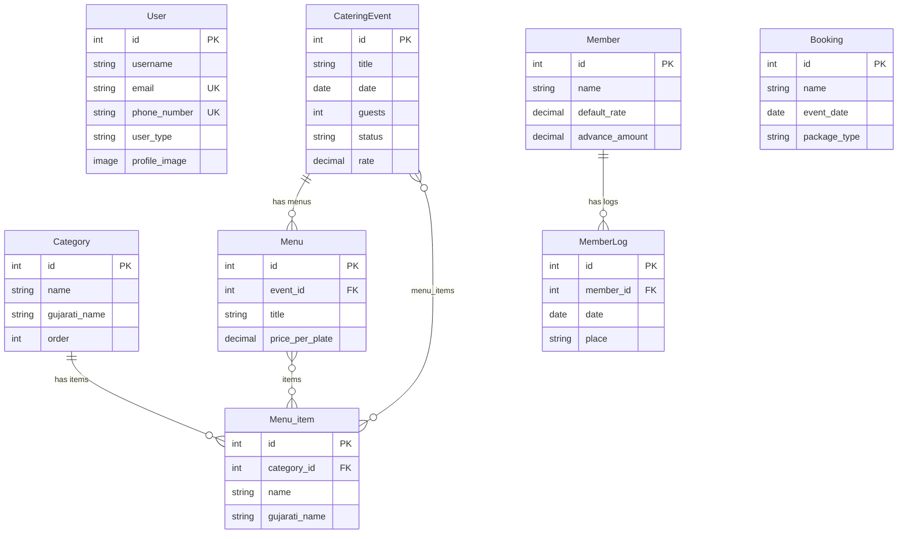
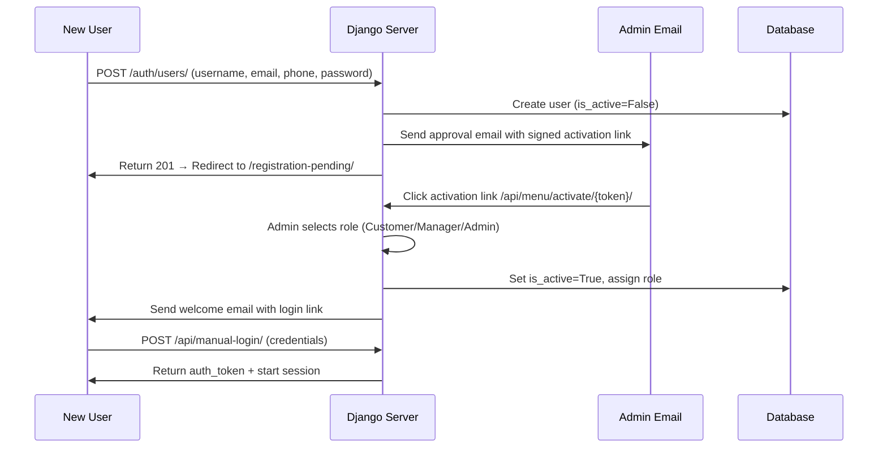

# 🍽️ Swagat Caterers – Smart Catering Platform

<div align="center">


**Transforming Traditional Catering into a Modern Digital Experience**

[🌐 Live Website](https://swagat-caterers-platform-production.up.railway.app) • [📧 Contact](#-contact) • [🚀 Features](#-key-features) • [💼 Author](#-author)

---

</div>

## ⚠️ Code Protection Notice

> **🔒 This is a CLOSED-SOURCE, PROPRIETARY project.**

This repository is **PUBLIC for viewing and evaluation purposes ONLY**.

### ❌ NOT Permitted:
- Copying, cloning, or forking this code
- Using any part of this code in your own projects
- Modifying or creating derivative works
- Commercial or personal use without explicit permission
- Redistributing or sharing the code

### ✅ Permitted:
- Viewing the code for learning and understanding
- Evaluating the project for employment/collaboration opportunities
- Providing feedback or suggestions to the author

### 📜 Legal Notice:
All code, designs, and intellectual property are owned exclusively by **Preet Makadiya** and **Swagat Caterers**. Unauthorized use will be pursued legally.

**For licensing or collaboration:** Contact [makadiyapreeta1@gmail.com](mailto:makadiyapreeta1@gmail.com)

---

## 📖 Table of Contents

- [Overview](#-overview)
- [Key Features](#-key-features)
- [Tech Stack](#️-tech-stack)
- [Project Structure](#-project-structure)
- [System Architecture](#️-system-architecture)
- [Database Schema](#-database-schema--models)
- [API Reference](#-api-reference)
- [Frontend Pages & Components](#-frontend-pages--components)
- [Authentication & Security](#-authentication--security)
- [Email & Notification System](#-email--notification-system)
- [Deployment & Infrastructure](#-deployment--infrastructure)
- [Environment Variables](#-environment-variables)
- [Local Development Setup](#-local-development-setup)
- [Use Cases](#-use-cases)
- [Project Stats](#-project-stats)
- [Author](#-author)
- [License](#-license)
- [Contact](#-contact)

---

## 🎯 Overview

**Swagat Caterers** is a production-grade, full-stack catering management platform built with **Django 6.0** and **Django REST Framework**. It digitizes every aspect of a catering business — from public-facing menu browsing and online booking to internal event management, staff tracking, financial analytics, and automated billing.

The platform serves two distinct audiences:
- **Public Customers** — Browse menus, get price estimates, book events, and contact the business
- **Internal Staff (Managers/Admins)** — Manage events, track members/staff, create custom menus, generate bills, and view analytics via a protected dashboard

### 🌟 What Makes It Special?

| Feature | Description |
|---------|-------------|
| **Role-Based Access** | Three-tier user system (Customer, Manager, Admin) with admin-approved registration |
| **Bilingual Menus** | Complete English & Gujarati support with PDF generation in both languages |
| **Real Business** | Not a portfolio demo — serves an actual catering operation at [swagatcaterers.in](https://swagatcaterers.in) |
| **Cloud-Native** | Deployed on Railway with PostgreSQL, Cloudinary media, and Brevo transactional email |
| **Admin Approval Flow** | New users require admin approval via email link before account activation |

---

## ✨ Key Features

### 🌐 Public-Facing (No Login Required)

| Feature | Description |
|---------|-------------|
| **Home Page** | Hero section, featured packages, testimonials, stats, FAQ, and CTAs |
| **Interactive Menu** | Categorized menu browsing with images and bilingual support (EN/GU) |
| **Custom Menu Builder** | Drag-and-drop menu customization with live price estimation |
| **Online Booking** | Multi-step booking form with email notification to business owner |
| **Gallery** | Event photography and food presentation showcase |
| **Contact** | Multiple contact methods, embedded Google Maps, and enquiry form |
| **Menu Flipbook** | Interactive page-turning menu experience with zoom and fullscreen |
| **PDF Downloads** | Downloadable English and Gujarati menu PDFs |

### 🔒 Protected Dashboard (Login Required)

| Feature | Description |
|---------|-------------|
| **Dashboard** | Central hub with event overview, quick actions, and analytics |
| **Event Management** | Full CRUD for catering events with status tracking (Pending/Confirmed/Cancelled) |
| **Menu Creator** | Create multiple menus per event with per-plate pricing |
| **Member Tracker** | Track staff members, daily logs, rates, advances, and settlements |
| **Booking Management** | View and manage customer booking enquiries |
| **Bill Generator** | Generate printable bills with cost breakdowns |
| **Profile Management** | Update profile image, email, and phone (stored on Cloudinary) |
| **Direct Menu View** | Quick menu reference for event managers |

---

## 🛠️ Tech Stack

### Backend
| Technology | Version | Purpose |
|-----------|---------|---------|
| **Python** | 3.14 | Core language |
| **Django** | 6.0 | Web framework |
| **Django REST Framework** | 3.16.1 | REST API layer |
| **Djoser** | 2.3.3 | Authentication endpoints (signup, login, token) |
| **SimpleJWT** | 5.5.1 | JWT token authentication |
| **PostgreSQL** | — | Primary database (via `psycopg2-binary`) |
| **Gunicorn** | 23.0.0 | WSGI production server |
| **WhiteNoise** | 6.11.0 | Static file serving in production |
| **Cloudinary** | 1.44.1 | Cloud media storage (images) |
| **Anymail (Brevo)** | 14.0 | Transactional email via Brevo/Sendinblue API |
| **Twilio** | 9.9.0 | SMS/WhatsApp notifications (planned) |
| **dj-database-url** | 3.1.0 | Database URL parsing for Railway |
| **Pillow** | 12.0.0 | Image processing |
| **django-cors-headers** | 4.9.0 | CORS handling |

### Frontend
| Technology | Purpose |
|-----------|---------|
| **HTML5** | Semantic markup with SEO and accessibility |
| **CSS3** | Custom properties, Flexbox, Grid, animations, media queries |
| **JavaScript (ES6+)** | DOM manipulation, API calls, form validation, dynamic content |
| **Bootstrap 5** | Responsive grid and pre-built components |
| **Django Templates** | Server-side rendering with template inheritance |
| **Font Awesome** | Icon library |
| **Google Fonts** | Playfair Display & Montserrat typography |

### Infrastructure & DevOps
| Service | Purpose |
|---------|---------|
| **Railway** | Production hosting (backend + PostgreSQL) |
| **Cloudinary** | Media file CDN and storage |
| **Brevo (Sendinblue)** | Transactional email delivery |
| **Git/GitHub** | Version control |

---

## 📁 Project Structure

```
Swagat_caterers/
├── .gitignore                       # Root gitignore (secrets, venv, OS files)
├── LICENSE                          # Proprietary license
├── README.md                        # This file
│
└── backend/                         # Django project root
    ├── manage.py                    # Django CLI entry point
    ├── Procfile                     # Railway deployment command
    ├── requirements.txt             # Python dependencies (42 packages)
    ├── check.py                     # Media path diagnostics script
    ├── .gitignore                   # Backend-specific gitignore
    │
    ├── backend_site/                # Django project configuration
    │   ├── __init__.py
    │   ├── settings.py              # Main settings (DB, email, auth, CORS, security)
    │   ├── urls.py                  # Root URL routing (69 lines, 25+ routes)
    │   ├── views.py                 # User activation view
    │   ├── wsgi.py                  # WSGI config for Gunicorn
    │   └── asgi.py                  # ASGI config
    │
    ├── catering/                    # Main Django app
    │   ├── __init__.py              # App config loader
    │   ├── apps.py                  # CateringConfig (loads signals)
    │   ├── models.py                # 8 database models (157 lines)
    │   ├── views.py                 # 20+ views — API + template rendering (340 lines)
    │   ├── serializers.py           # 10 DRF serializers (179 lines)
    │   ├── urls.py                  # App-level URL routing with DRF Router
    │   ├── admin.py                 # Custom admin with inlines & filters
    │   ├── signals.py               # Post-save email notifications (116 lines)
    │   ├── backends.py              # Custom auth: Email/Phone/Username login
    │   ├── tests.py                 # Test file
    │   └── migrations/              # 16 migration files tracking schema evolution
    │
    ├── templates/                   # HTML templates only (served by Django)
    │   ├── index.html               # Home page
    │   ├── menu.html                # Public menu browsing
    │   ├── about.html               # About page
    │   ├── gallery.html             # Photo gallery
    │   ├── contact.html             # Contact page
    │   ├── booknow.html             # Booking form
    │   ├── customize_menu.html      # Custom menu builder (33K)
    │   ├── login.html               # Login page
    │   ├── signup.html              # Registration page
    │   ├── registration_pending.html # Pending approval notice
    │   ├── dashboard.html           # Admin dashboard (45K — largest page)
    │   ├── tracker.html             # Member/staff tracking (44K)
    │   ├── booking.html             # Event booking management
    │   ├── create_menu.html         # Menu creation tool (43K)
    │   ├── direct_menu.html         # Direct menu view (30K)
    │   ├── manager_menu.html        # Manager menu interface
    │   ├── print_bill.html          # Bill generation & printing (24K)
    │   ├── profile.html             # User profile management
    │   ├── 404.html                 # Custom error page
    │   └── components/              # 28 reusable HTML components
    │       ├── navbar.html
    │       ├── footer.html
    │       ├── home_hero.html
    │       ├── pricing.html
    │       ├── testimonials.html
    │       ├── faq.html
    │       ├── gallery_grid.html
    │       ├── stats.html
    │       ├── contact_form.html
    │       ├── contact_grid.html
    │       ├── menu_book.html
    │       ├── services.html
    │       ├── services_overview.html
    │       ├── team.html
    │       ├── story.html
    │       ├── features.html
    │       ├── highlights.html
    │       ├── hygiene.html
    │       ├── signature.html
    │       ├── estimator.html
    │       ├── blog.html
    │       ├── map.html
    │       ├── marquee.html
    │       ├── cta_banner.html
    │       ├── menu_cta.html
    │       ├── final_cta_home.html
    │       ├── urgency_popup.html
    │       └── detailed_why.html
    │
    ├── static/                      # Static assets (CSS, JS, images, fonts)
    │   ├── css/
    │   │   └── style.css            # Main stylesheet (22K, black & gold theme)
    │   ├── js/
    │   │   ├── menu_data_en.js      # English menu data (19K)
    │   │   └── menu_data_gu.js      # Gujarati menu data (34K)
    │   ├── images/
    │   │   ├── logo/
    │   │   │   ├── logo.png         # Brand logo
    │   │   │   └── favicon.png      # Browser favicon
    │   │   ├── food/                # Food photography
    │   │   ├── img/                 # General images
    │   │   └── menu/                # Menu-related images
    │   ├── Gujarati.ttf             # Gujarati font
    │   └── Noto_Sans_Gujarati/      # Noto Sans Gujarati font family
    │
    ├── media/                       # User-uploaded files (Cloudinary in prod)
    │   ├── category_images/         # Menu category images
    │   └── profile_images/          # User profile pictures
    │
    ├── staticfiles/                 # Collected static files (auto-generated)
    └── venv/                        # Python virtual environment (not tracked)
```

---

## 🏗️ System Architecture

```
┌──────────────────────────────────────────────────────────────────┐
│                        CLIENT (Browser)                          │
│  HTML/CSS/JS/Bootstrap • Django Templates • Fetch API calls      │
└────────────────────────────┬─────────────────────────────────────┘
                             │
                             │  HTTPS (Railway SSL)
                             ▼
┌──────────────────────────────────────────────────────────────────┐
│                    DJANGO 6.0 APPLICATION                        │
│                                                                  │
│  ┌─────────────────────┐  ┌──────────────────────────────────┐  │
│  │   Template Views    │  │      REST API (DRF 3.16)         │  │
│  │   (Server-Side)     │  │                                  │  │
│  │                     │  │  • Token Auth (Djoser)           │  │
│  │  • index, menu,     │  │  • Session Auth (login_required) │  │
│  │    about, gallery   │  │  • ViewSets (CRUD)               │  │
│  │  • dashboard,       │  │  • Custom API views              │  │
│  │    tracker, booking │  │  • JSON responses                │  │
│  └─────────────────────┘  └──────────────────────────────────┘  │
│                                                                  │
│  ┌─────────────────────┐  ┌──────────────────────────────────┐  │
│  │   Django Signals    │  │     Custom Auth Backend          │  │
│  │                     │  │                                  │  │
│  │  • post_save: Admin │  │  EmailPhoneUsernameBackend:      │  │
│  │    approval email   │  │  Login via username, email,      │  │
│  │  • pre_save: User   │  │  or phone number                │  │
│  │    welcome email    │  │                                  │  │
│  └─────────────────────┘  └──────────────────────────────────┘  │
│                                                                  │
│  ┌──────────────────┐  ┌────────────────┐  ┌────────────────┐   │
│  │   WhiteNoise     │  │   Gunicorn     │  │  CORS Headers  │   │
│  │  (Static Files)  │  │  (WSGI Server) │  │  (API Access)  │   │
│  └──────────────────┘  └────────────────┘  └────────────────┘   │
└─────────┬──────────────────────┬────────────────────┬───────────┘
          │                      │                    │
          ▼                      ▼                    ▼
┌──────────────────┐  ┌──────────────────┐  ┌──────────────────┐
│   PostgreSQL     │  │   Cloudinary     │  │   Brevo SMTP     │
│   (Railway)      │  │   (Media CDN)    │  │   (Email API)    │
│                  │  │                  │  │                  │
│  8 tables        │  │  Profile images  │  │  Admin alerts    │
│  16 migrations   │  │  Category images │  │  Welcome emails  │
│  Relational data │  │  Food photos     │  │  Booking notifs  │
└──────────────────┘  └──────────────────┘  └──────────────────┘
```

---

## 🗃️ Database Schema & Models

The application uses **8 Django models** across 16 migrations:

### 1. `User` (Custom — extends `AbstractUser`)
| Field | Type | Details |
|-------|------|---------|
| `email` | EmailField | Unique, required |
| `phone_number` | CharField(15) | Unique, optional |
| `profile_image` | ImageField | Stored on Cloudinary |
| `user_type` | CharField | Choices: `customer`, `manager`, `admin` |

### 2. `Category`
| Field | Type | Details |
|-------|------|---------|
| `name` | CharField(100) | Category name (English) |
| `gujarati_name` | CharField(100) | Category name (Gujarati) |
| `image` | ImageField | Category thumbnail |
| `order` | PositiveIntegerField | Display sort order |

### 3. `Menu_item`
| Field | Type | Details |
|-------|------|---------|
| `category` | ForeignKey → Category | Parent category |
| `name` | CharField(100) | Dish name (English) |
| `gujarati_name` | CharField(200) | Dish name (Gujarati) |
| `description` | TextField | Dish description |
| `image` | ImageField | Dish photo |

### 4. `CateringEvent`
| Field | Type | Details |
|-------|------|---------|
| `title` | CharField(200) | Event name |
| `venue` | CharField(200) | Event location |
| `contact_number` | CharField(15) | Contact phone |
| `date` | DateField | Event date |
| `guests` | IntegerField | Guest count |
| `event_type` | CharField(100) | Wedding, Corporate, etc. |
| `status` | CharField | `pending` / `confirmed` / `cancelled` |
| `rate` | DecimalField | Rate per plate |
| `advance_amount` | DecimalField | Advance payment received |
| `staff_count` | IntegerField | Staff assigned |
| `menu_items` | ManyToMany → Menu_item | Selected dishes |
| **Properties**: `total_cost` (guests × rate), `pending_amount` (total − advance), `is_settled` |

### 5. `Menu`
| Field | Type | Details |
|-------|------|---------|
| `event` | ForeignKey → CateringEvent | Parent event |
| `title` | CharField(100) | Menu name (e.g., "Lunch", "Dinner") |
| `price_per_plate` | DecimalField | Per-plate cost |
| `items` | ManyToMany → Menu_item | Dishes in this menu |
| `note` | TextField | Additional notes |

### 6. `Member`
| Field | Type | Details |
|-------|------|---------|
| `name` | CharField(100) | Staff member name |
| `phone` | CharField(15) | Phone number |
| `default_rate` | DecimalField | Default daily rate (₹500) |
| `advance_amount` | DecimalField | Running advance balance |

### 7. `MemberLog`
| Field | Type | Details |
|-------|------|---------|
| `member` | ForeignKey → Member | Parent member |
| `date` | DateField | Work date |
| `place` | CharField(200) | Work location |
| `staff_count` | IntegerField | Staff present |
| `rate`, `total_amount`, `advance_given`, `settled_amount` | DecimalField | Financial details |
| `entry_by` | CharField(100) | Who created this log |

### 8. `Booking`
| Field | Type | Details |
|-------|------|---------|
| `name` | CharField(100) | Customer name |
| `phone` | CharField(20) | Customer phone |
| `event_date` | DateField | Requested event date |
| `event_type` | CharField(50) | Type of event |
| `guest_count` | IntegerField | Number of guests |
| `meal_time` | CharField(50) | Meal timing preference |
| `package_type` | CharField(100) | Selected package |
| `venue` | CharField(200) | Event venue |
| `message` | TextField | Additional message |

### Entity Relationship Diagram



---

## 🔌 API Reference

### Authentication Endpoints (Djoser)
| Method | Endpoint | Description |
|--------|----------|-------------|
| `POST` | `/auth/users/` | Register new user |
| `POST` | `/auth/token/login/` | Get auth token |
| `POST` | `/auth/token/logout/` | Invalidate token |
| `GET` | `/auth/users/me/` | Get current user profile |
| `POST` | `/api/manual-login/` | Session + Token login (custom) |

### Menu & Category APIs
| Method | Endpoint | Auth | Description |
|--------|----------|------|-------------|
| `GET` | `/api/menu/menu-list/` | Public | Get full menu with categories & items |
| `GET/POST` | `/api/menu/categories/` | Token | List/Create categories |
| `GET/PUT/DELETE` | `/api/menu/categories/{id}/` | Token | Category CRUD |
| `GET/POST` | `/api/menu/menu-items/` | Token | List/Create menu items |
| `GET/PUT/DELETE` | `/api/menu/menu-items/{id}/` | Token | Menu item CRUD |
| `GET/POST` | `/api/menu/menus/` | Token | List/Create event menus |

### Event Management APIs
| Method | Endpoint | Auth | Description |
|--------|----------|------|-------------|
| `GET/POST` | `/api/menu/events/` | Token | List/Create catering events |
| `GET/PUT/DELETE` | `/api/menu/events/{id}/` | Token | Event CRUD |

### Member & Tracker APIs
| Method | Endpoint | Auth | Description |
|--------|----------|------|-------------|
| `GET/POST/PUT` | `/api/menu/members/` | Token | Member management (with log creation on update) |
| `GET` | `/api/menu/logs/` | Token | Read-only member logs (filterable by date range) |
| `GET` | `/api/menu/logs/?start_date=X&end_date=Y` | Token | Filter logs by date |

### Booking & Communication APIs
| Method | Endpoint | Auth | Description |
|--------|----------|------|-------------|
| `POST` | `/api/menu/api/book-event/` | Public | Submit booking enquiry + email notification |
| `POST` | `/api/menu/send-email/` | Public | Send contact enquiry email |

### User Management APIs
| Method | Endpoint | Auth | Description |
|--------|----------|------|-------------|
| `PATCH` | `/api/menu/update-profile/` | Token | Update email, phone, or profile image |
| `GET/POST` | `/api/menu/activate/{token}/` | Admin Link | Approve & activate new users |

---

## 🖥️ Frontend Pages & Components

### Public Pages (19 HTML templates)
| Page | File | Size | Description |
|------|------|------|-------------|
| Home | `index.html` | 6.6K | Landing page with hero, packages, testimonials |
| Menu | `menu.html` | 10K | Public menu browsing with categories |
| Custom Menu | `customize_menu.html` | 33K | Interactive menu builder with price estimation |
| Book Now | `booknow.html` | 6.8K | Multi-step booking form |
| About | `about.html` | 3.3K | Company story, team, and values |
| Gallery | `gallery.html` | 3.8K | Event photo showcase |
| Contact | `contact.html` | 3.3K | Contact form with Google Maps |
| Login | `login.html` | 7.7K | Login page (username/email/phone) |
| Signup | `signup.html` | 7.5K | Registration form |
| Pending | `registration_pending.html` | 2.4K | Approval waiting screen |
| 404 | `404.html` | 11.6K | Custom error page |

### Protected Pages (Login Required)
| Page | File | Size | Description |
|------|------|------|-------------|
| Dashboard | `dashboard.html` | **45.8K** | Central management hub with analytics |
| Tracker | `tracker.html` | **44.6K** | Staff member tracking and logs |
| Create Menu | `create_menu.html` | **43.7K** | Menu builder for events |
| Direct Menu | `direct_menu.html` | 30.2K | Quick menu reference view |
| Booking | `booking.html` | 10.2K | Event booking details |
| Print Bill | `print_bill.html` | 24.3K | Invoice/bill generator |
| Profile | `profile.html` | 9.1K | User profile editor |
| Manager Menu | `manager_menu.html` | 7.1K | Manager-specific menu view |

### Reusable Components (28 HTML fragments)
Modular, reusable HTML components loaded via Django template ``:

| Category | Components |
|----------|-----------|
| **Layout** | `navbar.html`, `footer.html`, `marquee.html` |
| **Home Sections** | `home_hero.html`, `stats.html`, `features.html`, `highlights.html`, `signature.html`, `services.html`, `services_overview.html`, `detailed_why.html` |
| **Trust & Social** | `testimonials.html`, `team.html`, `story.html`, `hygiene.html`, `blog.html` |
| **Menu** | `menu_book.html` (flipbook), `menu_cta.html`, `pricing.html`, `estimator.html` |
| **Contact** | `contact_form.html`, `contact_grid.html`, `map.html` |
| **CTAs & Popups** | `cta_banner.html`, `final_cta_home.html`, `urgency_popup.html` |
| **Gallery** | `gallery_grid.html` |
| **FAQ** | `faq.html` |

### Static Assets
| Type | Files | Details |
|------|-------|---------|
| **CSS** | `css/style.css` (22.8K) | Main stylesheet with black & gold theme |
| **JS** | `js/menu_data_en.js` (19.4K) | English menu data |
| **JS** | `js/menu_data_gu.js` (34.3K) | Gujarati menu data |
| **Fonts** | `Gujarati.ttf`, `Noto_Sans_Gujarati/` | Gujarati language fonts |
| **Images** | `images/` | Logo, food, background, cover, and event images |

---

## 🔐 Authentication & Security

### User Registration Flow



### Authentication Methods
- **Token Authentication** — DRF TokenAuthentication for API access
- **Session Authentication** — Django sessions for `@login_required` template views
- **Dual Login** — Custom `manual_session_login` creates both session AND token
- **Custom Backend** — `EmailPhoneUsernameBackend` allows login via username, email, OR phone number

### Security Measures
| Feature | Implementation |
|---------|---------------|
| HTTPS enforcement | `SECURE_SSL_REDIRECT = True` in production |
| HSTS | 1-year duration with subdomains and preload |
| CSRF protection | `CSRF_TRUSTED_ORIGINS` for Railway domain |
| Secure cookies | `SESSION_COOKIE_SECURE`, `CSRF_COOKIE_SECURE` |
| Password validation | 4 Django validators (similarity, length, common, numeric) |
| CORS | Restricted to Railway production domain |
| Signed tokens | Django's `Signer` for user activation links |
| Admin approval | New accounts locked until admin approves via email |

---

## 📧 Email & Notification System

The platform uses **Brevo (Sendinblue)** via `django-anymail` for transactional emails:

### Email Triggers
| Event | Recipient | Content |
|-------|-----------|---------|
| New user registration | Admin (`swagatcaterersofficial@gmail.com`) | HTML email with user details + approval button |
| Admin approves user | New user | Welcome email with login link |
| New booking enquiry | Admin | Booking details (name, phone, date, guests, package) |
| Contact form submission | Admin | Enquiry details |

### Django Signals
- **`post_save` on User** — Deactivates new non-superuser accounts and sends admin approval email
- **`pre_save` on User** — Detects `is_active` change from False → True and sends welcome email

---

## 🚀 Deployment & Infrastructure

### Production Environment
| Component | Service | Details |
|-----------|---------|---------|
| **Application** | Railway | Django + Gunicorn WSGI |
| **Database** | Railway PostgreSQL | With SSL (`sslmode=require`) |
| **Static Files** | WhiteNoise | `CompressedManifestStaticFilesStorage` |
| **Media Files** | Cloudinary | Profile images, category images, food photos |
| **Email** | Brevo SMTP | `smtp-relay.brevo.com:587` (TLS) |
| **Domain** | Railway | `swagat-caterers-platform-production.up.railway.app` |

### Procfile
```
web: python manage.py collectstatic --noinput && gunicorn backend_site.wsgi
```

### Key Commands
```bash
# Database migrations
python manage.py makemigrations
python manage.py migrate

# Create superuser
python manage.py createsuperuser

# Collect static files
python manage.py collectstatic --noinput

# Run dev server
python manage.py runserver

# Run production server
gunicorn backend_site.wsgi

# Backup database
pg_dump -U makadiyapreet -d catering_db > backup.sql

# Restore database
psql -U makadiyapreet -d catering_db < backup.sql

# Update requirements
pip freeze > requirements.txt
```

---

## 🔑 Environment Variables

| Variable | Description |
|----------|-------------|
| `SECRET_KEY` | Django secret key |
| `DEBUG` | Debug mode toggle (`True`/`False`) |
| `DATABASE_URL` | PostgreSQL connection string (Railway) |
| `ALLOWED_HOSTS` | Comma-separated allowed hostnames |
| `DJANGO_SETTINGS_MODULE` | `backend_site.settings` |
| `PYTHON_VERSION` | Python runtime version |
| `CLOUDINARY_CLOUD_NAME` | Cloudinary cloud name |
| `CLOUDINARY_API_KEY` | Cloudinary API key |
| `CLOUDINARY_API_SECRET` | Cloudinary API secret |
| `EMAIL_HOST_PASSWORD` | Brevo SMTP API password |
| `SENDINBLUE_API_KEY` | Brevo/Sendinblue API key |

---

## 💻 Local Development Setup

### Prerequisites
- Python 3.14+
- PostgreSQL 16+
- Git

### Installation

```bash
# 1. Clone the repository
git clone https://github.com/makadiyapreet/swagat-caterers-platform.git
cd swagat-caterers-platform/backend

# 2. Create virtual environment
python -m venv venv
source venv/bin/activate  # macOS/Linux
# venv\Scripts\activate   # Windows

# 3. Install dependencies
pip install -r requirements.txt

# 4. Create PostgreSQL database
createdb catering_db

# 5. Set environment variables
export SECRET_KEY="your-secret-key"
export DEBUG=True
# Set other env vars as needed (Cloudinary, Email, etc.)

# 6. Run migrations
python manage.py makemigrations
python manage.py migrate

# 7. Create superuser
python manage.py createsuperuser

# 8. Run development server
python manage.py runserver
```

The application will be available at `http://127.0.0.1:8000/`

---

## 💼 Use Cases

### 🎊 Wedding Catering
A couple planning a 500-guest wedding reception → Browse wedding packages, customize menu with family favorites, get instant quote, download bilingual PDF, book via form with email confirmation.

### 🏢 Corporate Events
HR organizing a 200-person annual dinner → Select corporate package, filter for dietary needs (Jain, vegan), calculate pricing, coordinate with catering team via dashboard.

### 🛕 Religious & Community Events
Temple organizing a 1000+ person festival → Access Gujarati menus, select satvik/Jain dishes, bulk pricing, traditional serving styles.

### 🎂 Private Celebrations
Family hosting a 50-guest birthday → Browse small-gathering packages, mix & match dishes, quick WhatsApp communication, instant pricing.

---

## 📊 Project Stats

### Development Metrics
| Metric | Value |
|--------|-------|
| **First Commit** | December 27, 2025 |
| **Latest Update** | January 18, 2026 |
| **Total Commits** | 89 |
| **Lines of Code** | 12,600+ (excl. migrations, venv, static) |
| **HTML Pages** | 19 full pages |
| **Reusable Components** | 28 HTML fragments |
| **Database Models** | 8 models |
| **Database Migrations** | 16 migration files |
| **API Endpoints** | 25+ routes |
| **Python Dependencies** | 42 packages |
| **Django App** | 1 (`catering`) |
| **Current Phase** | Production (Live on Railway) |

### Technical Highlights
| Category | Details |
|----------|---------|
| **Largest Page** | `dashboard.html` — 45.8 KB |
| **Menu Data** | 53.6 KB combined (19.4K EN + 34.3K GU) |
| **Serializers** | 10 DRF serializers with custom write logic |
| **ViewSets** | 6 ModelViewSets with router registration |
| **Custom Views** | 20+ function-based views |
| **Template Rendering** | 17 Django template views |
| **Auth Backends** | 2 (custom Email/Phone/Username + ModelBackend) |

---

## 👨‍💻 Author

### Preet Makadiya
**Computer Engineering Undergraduate**

Passionate about leveraging technology to solve real-world problems and bridge the gap between traditional businesses and digital transformation.

#### Expertise
- 🤖 Artificial Intelligence & Machine Learning
- 📊 Data Science & Analytics
- 🌐 Full-Stack Web Development (Django, DRF, JavaScript)
- 🔒 Cybersecurity
- ☁️ Cloud Deployment (Railway, Cloudinary)

#### Connect With Me
- 🌐 Portfolio: [makadiyapreet.github.io/PreetVerseX](https://makadiyapreet.github.io/PreetVerseX/?ref=github)
- 💼 GitHub: [@makadiyapreet](https://github.com/makadiyapreet)
- 🔗 LinkedIn: [Preet Makadiya](https://linkedin.com/in/preet-makadiya-13102004-p)
- 📧 Email: [makadiyapreeta1@gmail.com](mailto:makadiyapreeta1@gmail.com?subject=Regarding%20Swagat%20Caterers%20Project)
- 💬 WhatsApp: [+91 81602 38745](https://wa.me/918160238745?text=Hi%20Preet,%20I%20saw%20your%20Swagat%20Caterers%20project%20on%20GitHub!)

---

## 📜 License

**This project is PROPRIETARY and CLOSED-SOURCE. All rights reserved.**

© 2025–2026 Preet Makadiya & Swagat Caterers. All Rights Reserved.

This code and all associated materials are the exclusive intellectual property of Preet Makadiya and Swagat Caterers.

### ❌ STRICTLY PROHIBITED:
- **Copying** any part of this codebase
- **Forking** or cloning this repository for personal/commercial use
- **Modifying** or creating derivative works
- **Redistributing** or sharing the code
- **Using** any code, design, or logic in your own projects
- **Reverse engineering** or extracting business logic

### ✅ PERMITTED USES:
- **Viewing** the code to understand project architecture
- **Evaluating** for employment or collaboration opportunities
- **Providing feedback** via official contact channels

### ⚖️ Legal Enforcement
Unauthorized use, reproduction, or distribution constitutes copyright infringement and will be pursued to the fullest extent of the law.

### 🤝 Collaboration Inquiries
For licensing, collaboration, or custom development:
- 📧 Email: [makadiyapreeta1@gmail.com](mailto:makadiyapreeta1@gmail.com)
- 💬 WhatsApp: [+91 81602 38745](https://wa.me/918160238745)

---

## 🙏 Acknowledgments

- **Swagat Caterers Team** — For trust and collaboration
- **Beta Testers** — Friends and family who provided valuable feedback
- **Open Source Community** — Django, DRF, Bootstrap, and all amazing tools
- **Railway** — For seamless deployment infrastructure
- **Cloudinary** — For reliable media storage
- **Brevo** — For transactional email delivery

---

## 📞 Contact

Have questions, suggestions, or want to collaborate?

- 🌐 **Website**: [swagatcaterers.in](https://swagatcaterers.in?ref=github-contact)
- 🌐 **Portfolio**: [makadiyapreet.github.io/PreetVerseX](https://makadiyapreet.github.io/PreetVerseX/?ref=github)
- 💬 **WhatsApp**: [+91 81602 38745](https://wa.me/918160238745?text=Hi%20Preet,%20I%20saw%20Swagat%20Caterers%20on%20GitHub!)
- 📧 **Email**: [makadiyapreeta1@gmail.com](mailto:makadiyapreeta1@gmail.com?subject=Swagat%20Caterers%20Project%20Inquiry)
- 💼 **LinkedIn**: [Preet Makadiya](https://linkedin.com/in/preet-makadiya-13102004-p)

---

## ⭐ Show Your Support

If you found this project interesting:

- ⭐ **Star this repository** to show appreciation
- 💡 **Share feedback** for improvements
- 🤝 **Reach out** for collaboration opportunities
- 📢 **Connect on LinkedIn** for professional networking

**Note:** This project is closed-source and not available for copying or forking. For any usage inquiries, please contact the author directly.

---

<div align="center">

### 🚀 Built with passion, deployed with pride

**Swagat Caterers** — Where tradition meets technology

---

Made with ❤️ by [Preet Makadiya](https://github.com/makadiyapreet)

© 2025–2026 Swagat Caterers. All rights reserved.

📧 makadiyapreeta1@gmail.com | 💬 +91 81602 38745

</div>
